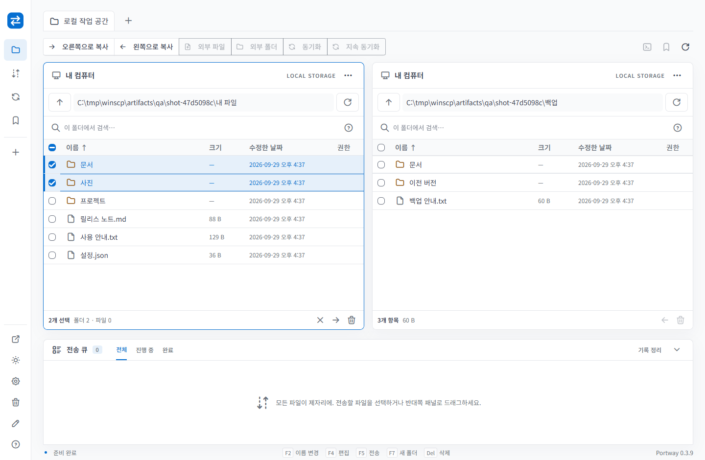

# Portway

Photino와 ASP.NET Core로 만든 Windows · macOS · Linux 파일 전송 앱입니다. 웹 UI를 각 OS의 WebView 안에서 실행하고, 파일 작업은 로컬 .NET 프로세스가 수행합니다. Velopack `vpk` 설치 패키지, 자동 업데이트 클라이언트, 자체 배포 서버를 함께 제공합니다.

현재 버전은 **0.3.9**입니다. 왼쪽 메뉴는 아이콘으로 접히고 마우스를 올리거나 키보드로 진입하면 펼쳐지는 Folded Hover 방식입니다. 로고 옆 Portway 텍스트의 세로 정렬과 체크박스 옆 말줄임표를 수정했습니다. 시스템 테마 옵션을 제거하고 Visual Studio 2026 톤의 다크 화면과 라이트↔다크 전환을 적용했습니다. Noto Sans KR, 기존보다 2px 큰 글자·아이콘, Tabler 기본 파란색 테마를 적용했습니다. 박스·체크박스 다중 선택, 우클릭 작업 메뉴, 키보드 탐색과 여러 항목 전송·이동을 제공합니다. Monaco 내장 편집기와 정돈된 공통 팝업도 포함합니다. 시작 시 백그라운드 업데이트 확인·다운로드와 다음 실행 시 무인 적용을 지원합니다. 주요 파일 관리 흐름이 실제 프로토콜 서버와 연결되어 동작합니다. 외부 파일·폴더 드롭, Tabler·Tabler Icons 웹 폰트·Master CSS 디자인 시스템, 라이트/다크 테마를 추가했습니다. 전체 WinSCP 기능 동등성은 아직 달성하지 못했습니다. [기능별 대체 검증표](doc/Portway.Document/docs/PARITY.md)와 [실행 검증 결과](doc/Portway.Document/jobs/VALIDATION.md)에 구현/검증/미구현을 구분했습니다.

## 가이드

- [현재 구현 복원 문서](doc/Portway.Document/docs/reverse-engineering/README.md): 기획·관리 검토를 위한 기획서·분석서·설계서·아키텍처와 요구사항 추적표.
- [솔루션 구조](doc/Portway.Document/docs/ARCHITECTURE.md) · [소스 탐색 가이드](doc/Portway.Document/docs/SOURCE-MAP.md): 프로젝트 경계, 주요 실행 흐름, 기능별 소스·테스트 진입점.
- [API 목록](doc/Portway.Document/docs/API-REFERENCE.md) · [리팩토링 및 검증 보고서](doc/Portway.Document/jobs/REFACTORING.md): 기능별 HTTP 경로, 코드 정리 범위와 검증 근거.
- [사용자 가이드](doc/Portway.Document/docs/USER-GUIDE.md): 설치, 서버 연결, 외부 파일·폴더 드롭, 전송·동기화·편집, 복구, 테마, 업데이트.
- [개발자 가이드](doc/Portway.Document/docs/DEVELOPER-GUIDE.md): 개발 환경, 구조, 디자인 시스템, API, 테스트, vpk 패키징, 배포 서버와 릴리스.
- [개발 지침](AGENTS.md) · [자동화 가이드](doc/Portway.Document/docs/AUTOMATION.md) · [배포 운영](doc/Portway.Document/docs/DEPLOYMENT.md).
- [문서 프로젝트](doc/Portway.Document/README.md): `doc/Portway.Document/docs/`의 가이드·이미지와 `doc/Portway.Document/jobs/`의 검증 기록 관리.



생성된 패키지: Windows는 **0.3.9**, Linux AppImage는 이전 **0.3.1**입니다. [Windows x64 설치 파일](dist/releases/win-x64-stable/Portway-win-x64-stable-Setup.exe), [Windows 포터블 ZIP](dist/releases/win-x64-stable/Portway-win-x64-stable-Portable.zip), [Linux x64 AppImage](dist/releases/linux-x64-0.3.1-stable/Portway-linux-x64-stable.AppImage). [SHA-256 체크섬](dist/SHA256SUMS.txt)도 포함했습니다. macOS 설치 파일은 Mac에서 릴리스 워크플로를 실행해야 생성됩니다.

## 구현 기능

- SFTP, SCP, FTP, 명시적/암시적 FTPS, WebDAV/HTTPS, S3 연결
- 로컬/원격 두 패널, 여러 연결 탭, 경로 이동, 검색, 정렬, 다중 선택, 패널 간 드래그 전송
- 탐색기·Finder·Linux 파일 관리자 → 원격 패널 드롭 업로드, 중첩·빈 폴더 보존, 청크 스트리밍·준비 취소
- 앱과 배포 센터의 일관된 Tabler UI, 오프라인 아이콘 웹 폰트, 테마 저장과 Visual Studio 2026 톤의 다크 화면
- 파일/폴더 업로드·다운로드, 이름 변경, 폴더 생성, 삭제, 즐겨찾기
- 영속 전송 큐, 앱 재시작 후 재개, 1–8개 동시 전송, 우선순위·예약·자동 재시도, 속도 제한
- 단방향/양방향 동기화, 변경 부분 선택·충돌 방향 지정, 마스크, 체크섬 재검사, 지속 동기화
- 16 MiB Monaco 내부 편집기(구문 강조·찾기/바꾸기·언어 선택·자동 줄바꿈), UTF-8/16/32·cp949, 외부 편집기 자동 업로드·충돌 보호, 대화형 SSH 터미널
- SSH 지문 고정, OpenSSH/PPK·Agent·MFA, HTTP/SOCKS 프록시, 점프 서버, TLS 인증서 핀, 암호화 Vault
- WinSCP INI 가져오기, WinSCP 6.5.7과 교차 검증한 SFTP 파일/이름 암호화
- 원격 복사·검색·해시·속성, 재귀 권한·소유자, 링크, 복원 가능한 로컬/원격 휴지통
- [CLI 및 .NET 자동화 API](doc/Portway.Document/docs/AUTOMATION.md), 사용자 SSH 명령
- OS/아키텍처/채널별 업데이트 피드, 시작 시 자동 확인·다운로드, 다음 실행 시 무인 적용, 수동 업데이트
- 관리자 인증을 사용하는 ZIP 릴리스 업로드, 다운로드 페이지, HTTP Range 다운로드

## 실행

개발 환경에는 [.NET 10 SDK](https://dotnet.microsoft.com/download/dotnet/10.0), 자산 빌드·패키징에는 Node.js 20 이상과 PowerShell 7이 필요합니다. Node.js는 앱 실행에 필요하지 않습니다. 자체 포함 패키지에는 .NET 런타임이 포함됩니다.

```powershell
npm ci --prefix assets/frontend
npm run build --prefix assets/frontend
dotnet restore Portway.slnx
dotnet run --project src/Portway.Desktop
```

- Windows: WebView2 Runtime이 필요합니다. vpk 설치 프로그램에 WebView2 의존성을 지정했습니다.
- macOS: 시스템 WebKit을 사용합니다. Intel/Apple Silicon 각각의 RID로 빌드합니다. 실제 macOS 실행 및 서명 검증은 아직 수행하지 않았습니다.
- Linux: GTK 3, WebKitGTK 4.1, libnotify가 필요합니다. Ubuntu 24.04 기준:

```bash
sudo apt-get install libgtk-3-0 libwebkit2gtk-4.1-0 libnotify4 libfuse2t64
```

Linux AppImage는 실행 권한을 지정한 뒤 실행합니다. FUSE가 없는 환경에서는 `--appimage-extract-and-run`을 사용할 수 있습니다. UI에는 그래픽 세션이 필요합니다.

첫 연결에서 서버 정보를 입력하고 SSH 지문을 서버 관리자가 제공한 값과 비교하세요. 암호를 저장하려면 사이드바의 **설정 및 업데이트 → 암호화 Vault**에서 12자 이상의 마스터 암호를 설정합니다. 마스터 암호를 잃으면 저장한 암호를 복구할 수 없습니다.

`F2` 이름 변경, `F4` 편집, `F5` 전송, `F7` 새 폴더, `Delete` 휴지통 이동, `Ctrl+A` 전체 선택, 방향키/Enter로 탐색합니다. 파일 메뉴의 영구 삭제는 휴지통을 거치지 않습니다.

## 외부 파일 드롭과 테마

서버에 연결한 뒤 탐색기·Finder·Linux 파일 관리자에서 파일 또는 폴더를 **오른쪽 원격 패널**에 놓고 충돌 정책을 확인해 전송합니다. 왼쪽 로컬 패널의 경로와 관계없이 현재 원격 폴더로 업로드합니다. 원본은 유지합니다. 파일·폴더 선택 버튼도 제공합니다. 폴더 선택은 브라우저 특성상 빈 폴더를 전달하지 못할 수 있으므로 빈 폴더까지 보존하려면 드롭을 사용하세요.

상단 테마 버튼으로 라이트 ↔ 다크를 전환하거나 설정에서 직접 선택합니다. 선택한 테마는 프로필에 저장됩니다. 처음 실행하거나 기존 시스템 설정을 가져오면 그 시점의 OS 밝기를 한 번 적용한 뒤 고정합니다. 다크 화면은 Visual Studio 2026의 중성 회색 톤을 사용합니다.

[드롭·디자인 시스템 설명](doc/Portway.Document/docs/DESIGN-AND-DROP.md), [개발 지침](AGENTS.md), [0.3.1 검증 결과](doc/Portway.Document/jobs/VALIDATION-0.3.1.md)를 참고하세요.

## 패키징

**대상 OS에서** 다음 스크립트를 실행합니다. Windows에서 macOS 설치 프로그램을 만드는 방식은 지원하지 않습니다. GitHub Actions 워크플로는 사용하지 않으므로 대상 OS별 빌드와 검증을 직접 실행합니다.

```powershell
./scripts/build.ps1 -Version 0.3.10 -Runtime win-x64 -Track stable
# macOS: osx-arm64 또는 osx-x64
# Linux: linux-x64 또는 linux-arm64
```

출력:

```text
dist/publish/<RID>/<VERSION>/                    자체 포함 앱
dist/releases/<RID>-<TRACK>/<version>/           해당 버전의 설치 파일 및 vpk 피드
dist/Portway-<VERSION>-<RID>-<TRACK>.zip            배포 서버에 보낼 묶음
```

Windows는 Setup.exe/Portable.zip, macOS는 Velopack 설치 패키지, Linux는 AppImage를 생성합니다. ZIP에는 해당 버전만 포함하며 서버가 이전 피드와 새 피드를 합쳐 변경분 업데이트를 제공합니다. 로컬의 최신 Full 또는 `-PreviousReleaseUrl <채널 URL>`로 받은 Full을 기준으로 Delta를 생성합니다. CI는 `PORTWAY_DISTRIBUTION_URL`이 설정되어 있으면 같은 채널의 최신 Full을 가져옵니다. 기준이 없는 최초 릴리스는 Full만 생성합니다. 자세한 옵션은 [패키징 가이드](doc/Portway.Document/docs/DEVELOPER-GUIDE.md#packaging)를 참고하세요. 릴리스 버전은 재사용하지 않으며 기존 패키지 변경은 거부합니다.

위의 0.3.10은 새 빌드 버전 예시입니다. 현재 Windows 패키지는 0.3.9이며, 이미 생성된 버전의 출력은 덮어쓰지 않습니다.

현재 생성한 Windows 설치 파일은 **서명되지 않았습니다**. 운영 배포에는 소유한 코드 서명 인증서를 연결하세요. Windows의 `PORTWAY_SIGN_PARAMS`는 vpk의 signtool 옵션으로 전달합니다. CI에서 인증서 설치/접근 설정은 인증서 제공 방식에 맞게 추가해야 합니다.

macOS 서명 및 공증 설정은 [배포 운영 문서](doc/Portway.Document/docs/DEPLOYMENT.md)에 있습니다.

## 배포 서버

개발 실행:

```powershell
$env:Distribution__ApiKey = [Convert]::ToHexString([Security.Cryptography.RandomNumberGenerator]::GetBytes(32))
$env:Distribution__DataPath = Join-Path $PWD 'artifacts/server-data'
dotnet run --project src/Portway.Server --urls http://127.0.0.1:5080
```

Docker 실행:

```powershell
$env:PORTWAY_PUBLISH_KEY = [Convert]::ToHexString([Security.Cryptography.RandomNumberGenerator]::GetBytes(32))
docker compose up -d --build
```

`http://127.0.0.1:5080`에 다운로드/관리 화면이 열립니다. 생성한 키는 안전하게 보관하고, 업로드 시 동일한 키를 사용하세요. 데이터는 `releases` 볼륨에 저장됩니다.

```powershell
./scripts/publish.ps1 -Server http://127.0.0.1:5080 -Channel win-x64-stable -Archive dist/Portway-0.3.9-win-x64-stable.zip
```

앱 설정의 업데이트 URL에는 **피드 파일이 들어 있는 디렉터리**를 입력합니다:

```text
https://downloads.example.com/releases/win-x64-stable/
```

설치된 앱의 채널/RID와 같은 URL을 저장하면 다음 실행부터 백그라운드에서 확인·다운로드합니다. 현재 작업을 중단하지 않고, 앱을 종료한 뒤 다음 시작에서 준비된 업데이트를 무인 적용합니다. 네트워크 오류는 앱 실행을 막지 않으며 다음 시작에 다시 시도합니다. 설정의 수동 업데이트도 사용할 수 있습니다. [0.3.3 자동 업데이트 검증 결과](doc/Portway.Document/jobs/VALIDATION-0.3.3.md)를 참고하세요. 개발 실행에서는 업데이트 설치가 비활성화됩니다. 공개 서버에는 HTTPS가 필요하며 localhost 테스트만 HTTP를 허용합니다. 공개 도메인과 Caddy 구성은 [배포 운영 문서](doc/Portway.Document/docs/DEPLOYMENT.md)를 참고하세요.

## 테스트

```powershell
dotnet test Portway.slnx -c Release
./scripts/test-integration.ps1
```

두 번째 명령에는 Linux 컨테이너 모드 Docker가 필요합니다. 자체 SSH/FTP/WebDAV/S3 테스트 서버를 시작해 실제 파일 전송·동기화를 검사하고 종료합니다. 테스트 계정과 포트는 개발용이며 모두 루프백에만 노출합니다.

실행 파일의 로컬 API 인증과 원격 편집 흐름은 fixture를 유지한 상태에서 검사할 수 있습니다:

```powershell
./scripts/test-integration.ps1 -KeepFixtures
./scripts/test-desktop.ps1 -Executable dist/publish/win-x64/0.3.9/Portway.exe
docker compose -p portway-tests -f tests/infrastructure/compose.yaml down
```

생성된 실제 vpk 파일과 서버의 업로드/다운로드 검증:

```powershell
$env:PORTWAY_PACKAGE_TEST = (Resolve-Path dist/Portway-0.3.9-win-x64-stable.zip).Path
dotnet test Portway.slnx -c Release --filter FullyQualifiedName~PackageTests
```

전체 검증 내역, 운영 전 확인할 항목, 미구현 기능은 [VALIDATION.md](doc/Portway.Document/jobs/VALIDATION.md)에 있습니다.

## 구조

```text
src/Portway.Core       프로토콜 어댑터, 파일 작업, 전송, 동기화
src/Portway.Cli        스크립트 실행 CLI, 설치 패키지의 cli/에 포함
src/Portway.Desktop    Photino 호스트, 로컬 API, 저장소, 웹 UI
src/Portway.Server     릴리스 저장/검증 API 및 다운로드 웹사이트
tests/Portway.Tests    단위/프로토콜/배포 통합 테스트
tests/infrastructure  실제 프로토콜 테스트 서버, Linux GUI 검증 이미지
scripts               빌드, 배포, macOS 서명, 통합 테스트
```

데스크톱 API는 임의 포트의 IPv4 루프백에만 바인딩하며 실행별 Bearer 토큰과 Origin/Host를 검사합니다. 일반 사용자의 파일 전송 트래픽은 배포 서버를 거치지 않습니다. 배포 서버에는 설치 파일만 저장됩니다.

프로필 기본 위치는 `.NET LocalApplicationData/Portway`입니다. `Portway__DataPath` 환경 변수로 변경할 수 있습니다. 호스트/사용자명 같은 연결 메타데이터는 평문이며 암호와 키 암호는 AES-GCM으로 암호화됩니다. SSH 개인 키 파일 자체는 사용자가 지정한 경로에서 읽습니다.

UI 개발용 브라우저 모드:

```powershell
$env:PORTWAY_TOKEN = [Convert]::ToHexString([Security.Cryptography.RandomNumberGenerator]::GetBytes(32))
$env:PORTWAY_PORT = '48751'
dotnet run --project src/Portway.Desktop -- --headless
```

콘솔에 출력된 토큰 포함 URL로 접속합니다. 이 URL은 로컬 파일에 접근할 수 있는 자격 증명이므로 공유하지 마세요. 브라우저 모드도 로컬 컴퓨터에 .NET 호스트가 있어야 합니다. 원격 다중 사용자 SaaS는 아닙니다.

기술 문서: [Photino](https://github.com/tryphotino/photino.NET), [Velopack](https://docs.velopack.io/), [SSH.NET](https://github.com/sshnet/SSH.NET), [FluentFTP](https://github.com/robinrodricks/FluentFTP). 의존성 라이선스는 [THIRD-PARTY-NOTICES.md](THIRD-PARTY-NOTICES.md)를 참고하세요.
