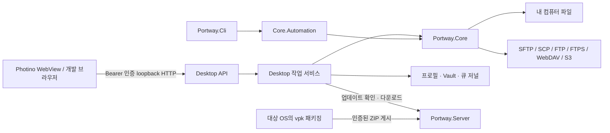
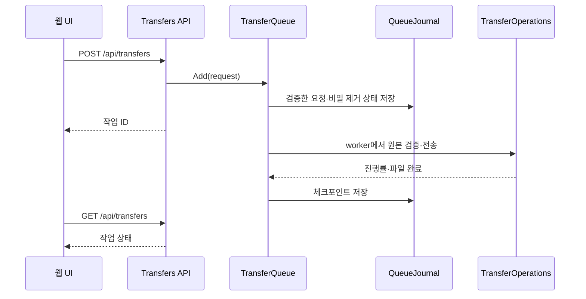

# Portway 솔루션 구조

이 문서는 현재 개발 소스의 책임과 의존 관계를 설명합니다. 설치 패키지의 기능·검증 범위는 [사용자 가이드](USER-GUIDE.md)와 [검증 기록](../jobs/VALIDATION.md)을 확인하세요. 소스를 읽는 순서는 [소스 탐색 가이드](SOURCE-MAP.md), HTTP 경로는 [API 목록](API-REFERENCE.md)에 정리했습니다.

## 프로젝트 경계

| 프로젝트 | 책임 | 직접 참조하는 프로젝트 |
| --- | --- | --- |
| Portway.Core | 프로토콜, 경로·파일 정책, 전송·동기화, 암호화, 프로세스 내부 자동화 | 없음 |
| Portway.Desktop | Photino 창, 인증된 loopback API, 프로필·Vault, 영속 큐와 작업 서비스, 웹 UI | Core |
| Portway.Cli | 명령줄 입력과 종료 코드, ScriptEngine 실행 | Core |
| Portway.Server | 릴리스 ZIP 검증·게시·다운로드와 배포 대시보드 | 없음 |
| Portway.Tests | Core·Desktop·Server의 단위·API·조건부 통합 검사 | Core, Desktop, Server |
| Portway.Document | JavaScript SDK의 `.esproj`에서 Node 콘솔·npm 구문 검사, `docs/`의 가이드·이미지와 `jobs/`의 검증 기록 관리 | 없음 |
| Portway.Artifact | 내부 `assets/` 파일을 실제 폴더 구조로 표시하고 루트 `deploy/`, `scripts/`는 와일드카드 링크로 표시 | 없음 |

OS 아이콘과 프런트엔드 빌드 프로젝트의 실제 위치는 `assets/Portway.Artifact/assets/`입니다. Artifact 프로젝트는 `Folder`로 `assets`를 명시하고 `None Include="assets/**/*" Visible="true"`로 내부 자산을 등록하며 `node_modules`를 제외합니다. 내부 자산은 `Link` 없이 실제 폴더 구조로 표시합니다. 생성한 웹 자산은 기존 Desktop·Server의 `wwwroot/vendor/`에 유지하며, 앱 실행 폴더에는 OS 아이콘의 파일명 그대로 복사합니다.

Server는 업데이트 패키지를 제공합니다. 원격 파일 전송은 Desktop 또는 CLI의 Core 구현이 서버와 직접 통신합니다. 웹 UI는 로컬 파일 API를 사용하며 서버의 웹 대시보드와 별도 앱입니다.

## Desktop 시작과 종료

[Program.cs](../../../src/Portway.Desktop/Program.cs)는 STA 진입점과 창 수명을 담당합니다.

1. Velopack을 초기화하고 이전 실행에서 다운로드한 업데이트를 먼저 적용합니다.
2. 임의 포트의 IPv4 loopback Kestrel과 실행별 Bearer 토큰을 준비합니다. headless QA 모드만 환경 변수로 토큰·포트를 지정할 수 있습니다.
3. [DesktopHosting.cs](../../../src/Portway.Desktop/DesktopHosting.cs)의 `AddDesktopServices`로 DI를 구성하고 `UseDesktopSecurity`를 적용합니다.
4. 정적 파일과 [DesktopApi.cs](../../../src/Portway.Desktop/DesktopApi.cs)의 기능별 경로를 등록한 뒤 호스트를 시작합니다.
5. Photino가 로컬 주소를 엽니다. `ProfileStore.DataPath/webview`를 전용 WebView 데이터 폴더로 사용하고 Debug 빌드에서만 개발자 도구를 켭니다. headless 모드에서는 창을 만들지 않습니다.
6. 창 종료 또는 호스트 종료 시 백그라운드 작업을 취소하고 서비스·연결을 정리합니다.

`TransferQueue`, `LiveSyncService`, `DropStore`는 API에서 사용하는 singleton과 hosted service가 같은 인스턴스입니다. `AutomaticUpdateWorker`는 호스트 시작 완료를 기다린 후 네트워크 작업을 수행합니다. 이 등록 방식을 변경하면 UI가 보는 작업과 실제 worker가 다른 상태를 갖는 문제가 생길 수 있습니다.

보안 미들웨어는 Host가 `127.0.0.1`인지 검사하고 `/api` 요청의 Bearer 토큰과 Origin을 확인합니다. API 응답은 `no-store`이며 CSP와 보안 헤더를 적용합니다. 일반 작업 오류는 기존 JSON 응답과 400·404·409로 반환합니다. 인증·Host·Origin 거부는 401·403 상태로 구분합니다.

## API와 서비스

`DesktopApi`는 partial class로 유지해 기존 중첩 요청 타입의 이름을 보존합니다. `Api/DesktopApi.*.cs`는 하나의 `/api` 그룹에 경로를 등록하고 작업 서비스를 호출합니다. 경로를 옮길 때 URL·HTTP 메서드·JSON 필드·기존 상태 코드를 함께 확인합니다.

| 기능 | API 등록 파일 | 작업 소유자 |
| --- | --- | --- |
| 사이트·Vault·설정·저장된 명령 | `DesktopApi.Profiles.cs` | ProfileStore, SiteExportService, Connections |
| 지문·인증·세션 | `DesktopApi.Connections.cs` | AuthenticationBroker, Connections, Core 프로토콜 |
| 파일 탐색·읽기·쓰기·파일 작업 | `DesktopApi.Files.cs` | LocalFiles, Connections, RemoteTextFiles, Core 파일 정책 |
| 전송·외부 드롭 | `DesktopApi.Transfers.cs` | TransferQueue, DropStore |
| 동기화·지속 동기화 | `DesktopApi.Synchronization.cs` | SyncService, LiveSyncService |
| 외부 편집·휴지통·터미널 | `DesktopApi.Tools.cs` | ExternalEditorService, TrashService, TerminalService |
| 업데이트 | `DesktopApi.Updates.cs` | UpdateService와 진행 중 작업 서비스 |

요청 DTO는 [DesktopApi.Contracts.cs](../../../src/Portway.Desktop/Api/DesktopApi.Contracts.cs), 공통 파일·전송 모델은 [Models.cs](../../../src/Portway.Core/Models.cs)에 있습니다. 비즈니스 처리는 서비스와 Core에 두고 API 등록 함수는 요청을 연결하는 역할을 유지합니다.

## 원격 연결과 프로토콜

[RemoteFactory](../../../src/Portway.Core/RemoteFactory.cs)는 Site를 검증하고 `IRemoteFileSystem` 구현을 선택합니다. 프로토콜 구현은 `Core/Protocols`에 있고 공통 인터페이스·Entry·Capabilities는 `Models.cs`에 있습니다.

Factory는 일반 구현을 `GuardedRemote`로 감싸 목록 이름과 경로를 검사합니다. 파일 암호화·점프 서버를 설정한 연결에는 각각 `EncryptedFileSystem`, `TunneledFileSystem`을 구성합니다. 기능은 `Capabilities`를 확인해 실행해야 하며 특정 프로토콜이 지원하지 않는 명령·권한·링크 작업을 임의로 우회하지 않습니다.

[Connections](../../../src/Portway.Desktop/Connections.cs)는 UI 연결을 관리합니다. `Connect`는 Vault에서 필요한 비밀을 복원하고 연결·초기 목록 조회를 완료한 뒤 ID를 등록합니다. `Use`는 연결별 semaphore로 작업을 직렬화하며 `Disconnect`는 진행 작업과 연결 자원 정리를 조정합니다. 전송 큐와 동기화는 별도 파일 시스템 연결을 만들어 UI 탐색과 작업 수명을 분리합니다.

## 전송과 재시작 복구

`TransferQueue`는 작업 상태·속도·우선순위·예약·재시도·취소를 관리합니다. `TransferOperations`는 재귀 파일 작업, 필터, 충돌 정책, 부분 파일·커밋, 체크섬, 타임스탬프와 이동 처리를 담당합니다. 동시 실행 수는 설정에서 1–8개로 제한합니다.

`QueueJournal`은 작업별 JSON을 저장합니다. 실행 중이던 작업은 다음 시작에서 자동 전송하지 않고 일시정지로 복원합니다. 원격 작업은 원래 서버·호스트 키·필요한 비밀을 확인한 뒤 이어하며 원본 크기·수정 시각과 파일별 스냅샷을 검사합니다. 비밀은 `SiteSecrets`로 제거합니다.

로컬 탭에서는 요청의 `direction`이 `local`이고 `sessionId`는 비어 있습니다. `LocalTransferFileSystem`이 다운로드 엔진의 원본 어댑터로 동작합니다. 절대 경로·같은 경로·포함 관계·링크/재분석 지점을 검증하고 바이너리 모드를 강제해 파일 내용과 줄바꿈을 보존합니다.

외부 드롭은 `drop.js → DropStore → TransferQueue` 순서입니다. 브라우저가 파일·폴더 참조를 읽고 청크를 보내면 DropStore가 전용 staging에 준비합니다. 완성된 배치만 큐에 넘기고 작업이 참조하는 임시 원본은 재시도·재시작까지 보존합니다.

## 웹 UI 상태와 렌더링

| 모듈 | 책임 |
| --- | --- |
| app.js | 화면 상태와 기능 조립, API 호출, 탭 전환, 팝업 제출, 갱신 |
| workspace-view.js | 사이드바·도구 모음·두 패널·상태바의 초기 마크업 |
| file-list-view.js | 이미 정렬·필터한 파일 행과 선택 도구 모음의 마크업 |
| ui.js | DOM 선택, HTML 이스케이프, Tabler 아이콘·버튼, 크기 형식 |
| explorer.js / selection.js | 실제 포커스·선택·키보드·컨텍스트 메뉴·드래그 |
| editor.js / editor-state.js | Monaco 수명과 저장 중 변경·ETag·인코딩·BOM |
| workflows.js / advanced.js / drop.js | 관련 고급 기능과 외부 드롭 흐름 |
| theme.js / design-tokens.css / app.css | 초기 테마·색상·배치 |
| display-time.js | 현지 날짜와 연결 경과 시간 형식 |

`local`/`remote`는 패널 위치입니다. 오른쪽이 로컬인지 여부는 `isLocal(side)`로 판단합니다. 오른쪽 로컬 상태와 서버별 pane을 분리해 탭 전환 시 경로·필터·선택을 보존합니다. 파일 목록 조회는 패널 참조·요청 ID·세션 ID를 확인해 오래된 응답을 버립니다.

뷰 모듈은 전달받은 데이터로 문자열을 만들며 API 호출·이벤트 등록·상태 변경을 하지 않습니다. 파일 이름·경로 같은 외부 값은 `esc`로 처리합니다. `/* HTML */` 주석을 붙인 템플릿은 Prettier가 HTML로 포맷합니다. 렌더링 뒤 선택 상태 반영과 이벤트 처리는 app.js와 explorer.js가 담당합니다.

## 편집·동기화·업데이트

원격 편집은 `Files API → Connections.Use → RemoteTextFiles` 순서입니다. 16 MiB 이하 일반 파일인지 검사하고 디코딩한 내용과 ETag를 반환합니다. 저장 전 ETag를 확인하고 임시 업로드 후 다시 원본을 확인해 `TransferOperations.Commit`으로 반영합니다. 편집기 모델·구독과 로컬 임시 파일의 수명을 함께 확인해야 합니다.

동기화는 `SyncService → Synchronizer.Preview → 사용자 선택 → Synchronizer.Apply` 순서입니다. 지속 동기화는 `LiveSyncService`가 변경 감시와 상태 복원을 관리합니다. 상태 조회와 UI 목록 재조회는 진행 작업과 분리합니다.

업데이트는 `AutomaticUpdateWorker → UpdateService → Velopack` 순서입니다. 자동·수동 작업을 직렬화하고 준비 실패를 앱 시작과 격리합니다. 시작 시 확인·다운로드한 패키지는 다음 실행의 Velopack 초기화에서 적용합니다. 수동 적용은 전송·동기화·외부 편집이 활성 상태이면 거부합니다.

## CLI와 배포 서버

CLI의 `Program.cs`는 인수·취소·종료 코드를 처리하고 Core의 `ScriptEngine`을 실행합니다. `ScriptEngine`은 명령을 해석하고 `Core.Automation.Session`으로 연결과 작업을 수행합니다. CLI는 Desktop의 loopback API나 Photino에 의존하지 않습니다.

Server의 `Program.cs`는 DI·보안 헤더·오류·업로드 속도 제한·정적 파일 파이프라인을 구성합니다. [ServerApi.cs](../../../src/Portway.Server/ServerApi.cs)는 상태·목록·다운로드·게시 경로를 등록합니다. `ReleaseStore`가 ZIP 경로·채널·자산 해시·기존 버전 불변성을 검사하고 채널별 게시를 직렬화합니다. Dockerfile은 이 서버의 컨테이너 배포를 위한 파일입니다.

`scripts/package.ps1`은 이전 Full을 기준으로 변경분을 만든 뒤 해당 버전만 별도 폴더와 ZIP으로 내보냅니다. 이전 패키지는 ZIP에 포함하지 않습니다. `ReleaseStore.Feeds.cs`는 피드를 버전·형식별로 합치고 변경분 기준·불변성을 검사하며 Velopack의 SemVer 비교를 사용합니다. 서버는 피드를 마지막에 교체하고 기존 변경분 연결을 보존합니다. Desktop의 기존 UpdateManager가 변경분 다운로드·복원과 Full 전환을 처리합니다.

## 변경할 때 지켜야 할 경계

- API 경로와 DTO를 바꾸면 웹 UI·CLI가 아닌 외부 Desktop API 호출자·저장 데이터의 영향을 각각 확인합니다.
- 작업 서비스 singleton과 hosted service 등록, 연결의 semaphore, 큐 체크포인트를 보존합니다.
- SSH/TLS 검증, loopback·Bearer·Origin·CSP, 비밀 제거와 경로 검증을 유지합니다.
- `wwwroot/vendor`와 Server의 공유 프런트엔드 자산은 빌드 원본에서 갱신합니다.
- 대상 OS의 네이티브 실행·WebView·설치 검증은 해당 OS에서 수행하고 단위 테스트나 모의 연결과 구분합니다.

작업과 검증의 상세 기준은 [AGENTS.md](../../../AGENTS.md)를 따릅니다.
