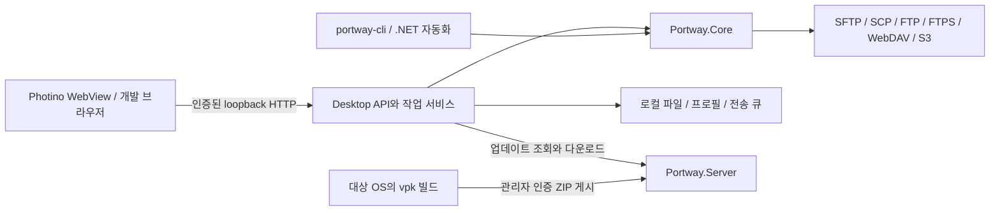

# Portway 개발자 가이드

특정 버전·변경 사항의 검증 기록은 [`assets/Portway.Document/jobs/`](../jobs/README.md)에 생성합니다. 개발·사용·배포 가이드와 API·구조 문서는 `assets/Portway.Document/docs/`에 유지합니다. JSON 기록은 `scripts/write-verification.ps1 -Name <영문 작업명 또는 버전> -Data <결과 객체>`로 생성하며 기존 기록을 덮어쓰지 않습니다. 원본 로그·TRX·스크린샷과 임시 프로필은 기존 산출물 폴더에 보관하고 보고서에서 연결합니다.

**기준 버전: 0.3.9 · 문서 기준일: 2026-10-01**

Portway는 Photino 데스크톱 호스트, 로컬 ASP.NET Core API, ES 모듈 웹 UI, 프로토콜 라이브러리, CLI, Velopack 배포 서버로 구성됩니다. 이 문서는 개발 환경 구성부터 기능 변경·검증·패키징·배포까지 안내합니다. 앱의 사용 흐름은 [사용자 가이드](USER-GUIDE.md)를 참고하세요.

작업 전에 루트의 [AGENTS.md](../../../AGENTS.md)를 읽습니다. 기능 지원 판단에는 [PARITY.md](PARITY.md), 실행 증거에는 [VALIDATION.md](../jobs/VALIDATION.md)를 사용합니다. 구현되어 있다는 사실과 실제 OS에서 검증했다는 사실을 구분합니다.

프로젝트에서 작성하는 주석과 로그·오류 설명은 한국어를 사용합니다. CLI 명령·옵션, API 필드와 구조화 로그의 치환 필드 이름은 유지합니다. ASP.NET Core·Photino 등 외부 라이브러리의 기본 로그와 원격 명령 출력은 원문으로 표시합니다. `wwwroot/vendor`의 생성 주석은 빌드 원본에서 수정하고 외부 라이선스 원문은 보존합니다.

## 목차

- [1. 준비할 도구](#prerequisites)
- [2. 개발 환경 빠른 시작](#quickstart)
- [3. 프로젝트 구조와 실행 흐름](#architecture)
- [4. 프런트엔드와 디자인 시스템](#frontend)
- [5. Core와 기능 확장](#core)
- [6. Desktop API와 보안 경계](#desktop-api)
- [7. 상태 저장과 외부 파일 드롭](#state)
- [8. 테스트와 브라우저 검증](#testing)
- [9. vpk 패키징과 버전 관리](#packaging)
- [10. 배포 서버 개발·게시·업데이트](#distribution)
- [11. CI와 운영 릴리스](#release)
- [12. 디버깅과 문서 관리](#maintenance)

<a id="prerequisites"></a>
## 1. 준비할 도구

| 도구 | 이 저장소의 기준과 용도 |
| --- | --- |
| .NET SDK | .NET 10. [global.json](../../../global.json)은 `10.0.100`, `latestFeature` roll-forward를 지정합니다. 기존 Windows 검증은 10.0.401에서 수행했습니다 |
| Node.js / npm | Node.js 20 이상. 프런트엔드 의존성 복원·정적 자산 생성·테스트에 사용하며 앱 실행 시에는 필요 없습니다 |
| PowerShell | PowerShell 7. `scripts/*.ps1` 실행에 사용합니다. Windows PowerShell 5.1을 기준으로 작성된 스크립트가 아닙니다 |
| Docker / Compose | 실제 SSH·FTP·WebDAV·S3 테스트 서버와 배포 서버 검증에 필요합니다. Windows에서는 Linux 컨테이너 모드를 사용합니다 |
| vpk | 전역 설치 대신 루트 [dotnet-tools.json](../../../dotnet-tools.json)의 Velopack 1.2.158을 `dotnet tool restore`로 복원합니다 |
| Python | Windows 설치·업데이트 QA 스크립트의 임시 피드 서버에 필요합니다. 일반 빌드에는 필요 없습니다 |

OS별 네이티브 UI 의존성은 다음과 같습니다.

| OS | 준비 사항 |
| --- | --- |
| Windows | WebView2 Runtime |
| macOS | 시스템 WebKit, 대상 CPU에 맞는 SDK/런타임. 배포용 서명·공증에는 Apple 인증서와 공증 자격 증명이 별도로 필요합니다 |
| Linux | GTK 3, WebKitGTK 4.1, libnotify, 그래픽 세션. Vault 자동 잠금 해제에는 Secret Service 제공자와 `secret-tool`이 필요합니다. AppImage 실행에는 FUSE 또는 추출 실행이 필요합니다 |

Ubuntu 24.04 기반 검증 이미지의 패키지와 Xvfb 구성은 [Dockerfile.linux](../../../tests/infrastructure/Dockerfile.linux)를 참고합니다. 이 이미지의 root/container 전용 WebKit 샌드박스 설정을 일반 데스크톱 실행 설정으로 복사하지 않습니다. 전체 OS 최소 버전·배포판 호환성은 아직 인증하지 않았습니다.

<a id="quickstart"></a>
## 2. 개발 환경 빠른 시작

모든 예시는 저장소 루트에서 실행합니다. `powershell` 코드 블록은 PowerShell 7 문법입니다. Windows에서 `npm.ps1` 실행 정책 때문에 실패하면 `npm` 대신 `npm.cmd`를 사용합니다.

```powershell
dotnet --version
node --version
pwsh --version
npm ci --prefix assets/Portway.Artifact/assets/frontend
npm run build --prefix assets/Portway.Artifact/assets/frontend
dotnet restore Portway.slnx
dotnet build Portway.slnx -c Release
```

설치된 앱의 설정과 분리된 개발 프로필로 실행합니다. 같은 프로필을 여러 앱 프로세스가 동시에 쓰지 않도록 합니다.

```powershell
$env:Portway__DataPath = Join-Path $PWD 'artifacts/dev/profile'
dotnet run --project src/Portway.Desktop
```

Photino 창 안에 두 패널 UI가 열리면 로컬 실행이 된 것입니다. 서버 작업에는 자신의 테스트 서버 또는 아래 통합 테스트 fixture를 사용합니다. 정상적인 앱 개발에 공개 배포 서버가 필요하지는 않습니다.

### 문서용 Node 프로젝트

문서·자산 프로젝트의 루트는 `assets/`이며 솔루션의 가상 폴더 이름도 `assets`입니다. 이전 루트 `doc/`에서 폴더 이름만 변경해 내부 상대 경로의 깊이는 유지합니다. 새 작업 명령과 기록 저장 경로는 `assets/`를 사용하고, 기존 검증 기록 안의 당시 명령·경로는 이력으로 보존합니다.

`Portway.slnx`의 `assets` 솔루션 폴더에는 [Portway.Document](../README.md)가 있습니다. 실제 프로젝트 경로는 `assets/Portway.Document`이며, Node.js 20 이상을 사용하는 기본 콘솔 프로젝트입니다. 프로젝트 파일은 [Portway.Document.esproj](../Portway.Document.esproj)이고 Artifact와 같은 JavaScript SDK 버전을 사용합니다. `.esproj`를 지원하는 Visual Studio JavaScript·TypeScript 프로젝트 도구와 `.vscode/launch.json`의 `Portway.Document` Node 프로필로 디버깅하도록 설정합니다. 실제 Visual Studio 실행 여부는 해당 검증 기록과 구분합니다.

```powershell
npm start --prefix assets/Portway.Document
npm run build --prefix assets/Portway.Document
dotnet run --project assets/Portway.Document/Portway.Document.esproj
```

현재 `build`는 진입점의 JavaScript 구문을 검사하며 `.esproj`의 `BuildCommand`로 프로젝트·솔루션 빌드에서도 실행합니다. 자동 npm 설치·감사는 비활성화하고 `StartupCommand`는 `npm run start`를 사용합니다. `src/`, `docs/`, `jobs/`와 디버깅 설정은 명시적으로 프로젝트에 표시합니다. 이전 `.njsproj`와 Node.js Tools 전용 `Build.targets`는 제거했으며 문서 프로젝트를 .NET 테스트 대상으로 실행하지 않습니다. 프로젝트를 문서 생성 도구로 확장할 때 해당 빌드 명령을 갱신합니다. 프로젝트 구성·명령은 프로젝트 README에 기록하고 개발·사용 가이드는 `assets/Portway.Document/docs/`, 작업별 검증 기록은 `assets/Portway.Document/jobs/`에 유지합니다.

같은 `assets` 솔루션 폴더의 [Portway.Artifact.esproj](../../Portway.Artifact/Portway.Artifact.esproj)는 내부의 `assets/Portway.Artifact/assets/`와 저장소 루트의 `deploy/`, `scripts/` 파일을 재귀 와일드카드로 연결합니다. OS 아이콘과 프런트엔드 프로젝트는 실제로 `assets/Portway.Artifact/assets/`에 보관하고, `assets/Portway.Artifact/assets/frontend/node_modules/`는 프로젝트 항목에서 제외합니다. 이 프로젝트는 파일 탐색용이므로 솔루션 빌드에서 별도 npm 설치나 빌드 스크립트를 실행하지 않습니다.

프런트엔드의 `build.cjs`와 포맷 명령은 `../../../../`로 저장소 루트의 소스와 설정을 참조하고, `tests/`의 테스트는 `../../../../../src/`로 UI 모듈을 읽습니다. 자산 생성 위치는 기존 Desktop·Server의 `wwwroot/vendor/`로 유지합니다. 아이콘 생성·Desktop 프로젝트·패키징 스크립트와 Linux Dockerfile도 새 자산 위치를 사용합니다.

Artifact는 자동 파일 등록을 끈 프로젝트입니다. Visual Studio 솔루션 탐색기에 내부 자산을 표시하도록 `Folder Include="assets\"`와 `None Include="assets/**/*" Visible="true"`를 명시합니다. 내부 자산에는 `Link`를 지정하지 않고 실제 폴더 구조를 사용하며 `node_modules` 제외 설정을 유지합니다. 프로젝트 설정을 편집할 때 이 등록을 제거하면 자산이 탐색기에서 사라집니다.

### Visual Studio에서 웹 UI 디버깅

Visual Studio 2026에서 `Portway.Desktop`을 시작 프로젝트로 지정하고 **Debug** 구성으로 실행합니다. 실행된 Portway 창의 웹 UI(예: 파일 검색 입력란)를 클릭해 포커스를 둔 뒤 **F12**를 누르면 WebView2 개발자 도구가 열립니다. Elements·Console·Network·Sources에서 UI와 JavaScript를 확인할 수 있습니다. C# 디버깅은 Visual Studio의 중단점을 사용합니다.

`Program.cs`는 `#if DEBUG`로 Photino의 `SetDevToolsEnabled(true)`를 적용합니다. Release 빌드는 개발자 도구를 비활성화합니다. 앱 창의 단축키 처리는 F12를 가로채지 않고 WebView2가 처리하도록 유지합니다.

네이티브 브라우저 프로필은 `ProfileStore.DataPath/webview`입니다. `Program.cs`는 해당 폴더를 생성한 뒤 Photino의 `SetTemporaryFilesPath`로 지정합니다. Photino 기본 `%LOCALAPPDATA%/Photino`를 다른 앱과 공유하면 서로 다른 브라우저 초기화 옵션 때문에 검은 화면이 발생할 수 있습니다. [WebView2의 사용자 데이터 폴더 관리](https://learn.microsoft.com/en-us/microsoft-edge/webview2/concepts/user-data-folder)와 [공유 프로세스 초기화 조건](https://learn.microsoft.com/en-us/microsoft-edge/webview2/concepts/process-model)을 참고하세요. 기존 공용 폴더와 사이트·Vault·전송 큐는 삭제하지 않습니다. `Portway__DataPath`로 격리한 검증은 WebView 프로필도 함께 격리됩니다.

Debug 검은 화면을 조사할 때 로컬 HTTP 응답만으로 정상 시작이라고 판단하지 마세요. 실제 Photino 창의 웹 콘텐츠 표시와 동일 프로필의 재시작, WebView에 포커스를 둔 F12를 확인합니다. 브라우저 프로필 변경 후에는 Visual Studio Debug 빌드를 다시 실행해야 적용됩니다.

### 일반 브라우저에서 디버깅

```powershell
$env:Portway__DataPath = Join-Path $PWD 'artifacts/dev/browser-profile'
dotnet run --project src/Portway.Desktop -- --headless
```

콘솔에 출력된 `http://127.0.0.1:<port>/#<token>` 전체를 같은 컴퓨터의 브라우저에서 엽니다. `--headless`는 Photino 창 없이 **동일한 로컬 API와 UI**를 실행합니다. 프로세스는 터미널의 `Ctrl+C`로 종료합니다.

포트는 기본적으로 임의 할당됩니다. headless 모드에서만 `PORTWAY_PORT`로 지정할 수 있고 `PORTWAY_TOKEN`으로 32자 이상의 토큰을 지정할 수 있습니다. 지정하지 않으면 실행마다 생성합니다. 이 URL과 토큰은 로컬 파일을 다룰 수 있는 자격 증명이므로 로그·이슈·스크린샷에 노출하지 않습니다. `localhost`로 바꾸면 Host 검사에 걸리므로 출력된 `127.0.0.1` 주소를 그대로 사용합니다.

소스 정적 파일은 빌드 출력으로 복사됩니다. 소스를 고친 뒤 앱을 재빌드·재실행하고 브라우저를 새로고침합니다. 자동 HMR 개발 서버는 구성되어 있지 않습니다.

<a id="architecture"></a>
## 3. 프로젝트 구조와 실행 흐름

상세 책임·수명은 [솔루션 구조](ARCHITECTURE.md), 처음 읽는 순서와 기능별 테스트는 [소스 탐색 가이드](SOURCE-MAP.md), 경로·요청 모델은 [API 목록](API-REFERENCE.md)에 있습니다. 코드 정리와 검증 범위는 [리팩토링 보고서](../jobs/REFACTORING.md)를 참고하세요.

```text
src/
  Portway.Core/           프로토콜, 경로·파일 정책, 전송, 동기화, 자동화
  Portway.Desktop/        Photino + loopback API + 프로필·큐·작업 서비스
    Api/                 기능별 DesktopApi partial class와 요청 계약
    wwwroot/             app.js, advanced.js, workflows.js, drop.js, CSS
  Portway.Cli/            스크립트 실행 CLI; 배포 패키지의 cli/에 포함
  Portway.Server/         릴리스 ZIP 검증·저장·다운로드 API와 대시보드
assets/Portway.Artifact/    Visual Studio 자산 탐색 프로젝트
  assets/               Windows·macOS·Linux 아이콘
    frontend/           고정 npm 의존성, build.cjs, 프런트엔드 테스트
scripts/                 빌드, 게시, 통합·설치·브라우저 QA
tests/Portway.Tests/      xUnit 단위·프로토콜·복구·배포 테스트
tests/infrastructure/    Docker fixture와 Linux GUI 검증 이미지
assets/Portway.Document/    문서용 Node 프로젝트
  docs/                  사용자·개발자·운영·API·구조 가이드와 이미지
  jobs/                  버전별·작업별 검증 보고서와 JSON
```



Desktop의 [Program.cs](../../../src/Portway.Desktop/Program.cs)는 Velopack 초기화 후 loopback Kestrel을 시작하고 Photino가 그 주소를 로드하도록 합니다. 웹 UI가 사용자의 로컬 경로에 직접 접근하는 구조가 아닙니다. 로컬 파일 작업은 인증된 API를 통해 .NET 코드가 수행합니다.

[DesktopHosting.cs](../../../src/Portway.Desktop/DesktopHosting.cs)는 서비스 등록과 보안·오류 미들웨어, [DesktopApi.cs](../../../src/Portway.Desktop/DesktopApi.cs)는 기능별 API 조립을 담당합니다. 원격 텍스트 편집은 [RemoteTextFiles.cs](../../../src/Portway.Desktop/RemoteTextFiles.cs)에 모았습니다. 배포 서버의 경로는 [ServerApi.cs](../../../src/Portway.Server/ServerApi.cs)에 있습니다.

배포 서버는 업데이트 패키지를 제공하는 별도 서비스입니다. 사용자의 전송 자격 증명이나 원격 파일을 중계하는 서비스로 사용하지 않습니다.

<a id="frontend"></a>
## 4. 프런트엔드와 디자인 시스템

### 소스별 역할

| 파일 | 수정할 내용 |
| --- | --- |
| [app.js](../../../src/Portway.Desktop/wwwroot/app.js) | 전체 상태, 패널, 사이트·전송·편집·동기화·설정 UI, 키보드 이벤트 |
| [workspace-view.js](../../../src/Portway.Desktop/wwwroot/workspace-view.js), [file-list-view.js](../../../src/Portway.Desktop/wwwroot/file-list-view.js) | 화면 골격과 파일 목록·선택 도구 마크업; 상태 변경·API 호출과 분리 |
| [ui.js](../../../src/Portway.Desktop/wwwroot/ui.js) | DOM 선택, HTML 이스케이프, Tabler 아이콘·버튼과 크기 표시 |
| [display-time.js](../../../src/Portway.Desktop/wwwroot/display-time.js) | 현지 날짜의 연도·오전/오후 표시, 접속 경과 시간 형식 |
| [explorer.js](../../../src/Portway.Desktop/wwwroot/explorer.js), [selection.js](../../../src/Portway.Desktop/wwwroot/selection.js) | 박스·범위·키보드 선택, 컨텍스트 메뉴, 내부 다중 드래그와 경로 기반 선택 모델 |
| [advanced.js](../../../src/Portway.Desktop/wwwroot/advanced.js) | 고급 인증, 전송 옵션, 프리셋, 추가 인증 질문 |
| [workflows.js](../../../src/Portway.Desktop/wwwroot/workflows.js) | 지속 동기화, 터미널, 외부 편집, 휴지통, 고급 파일 작업 |
| [drop.js](../../../src/Portway.Desktop/wwwroot/drop.js) | 외부 드롭과 파일 선택, 디렉터리 순회, 청크 준비·취소·큐 등록 |
| [editor.js](../../../src/Portway.Desktop/wwwroot/editor.js), [editor-state.js](../../../src/Portway.Desktop/wwwroot/editor-state.js) | Monaco 지연 로드, 언어·테마, 모델 수명, 저장 스냅샷·변경 감지·ETag |
| [app.css](../../../src/Portway.Desktop/wwwroot/app.css) | 워크스페이스와 컴포넌트 배치 |
| [design-tokens.css](../../../src/Portway.Desktop/wwwroot/design-tokens.css), [theme.js](../../../src/Portway.Desktop/wwwroot/theme.js) | 공유 테마 색상과 최초 렌더·기존 시스템 설정 변환 |
| [build.cjs](../../../assets/Portway.Artifact/assets/frontend/build.cjs) | npm 자산·폰트·라이선스 복사, Master CSS 생성, Server 공유 자산 동기화 |

현재 [package.json](../../../assets/Portway.Artifact/assets/frontend/package.json)은 `@tabler/core` 1.4.0, `@tabler/icons-webfont` 3.48.0, `@master/css` 1.37.8, xterm 6.0.0, `monaco-editor` 0.57.0과 빌드 도구 `esbuild` 0.28.2를 고정합니다. 의존성을 변경하면 lockfile과 라이선스 목록을 함께 갱신하고 대상 WebView에서 호환성을 확인합니다.

### Folded Hover 사이드바

0.3.9의 사이드바는 [Tabler Folded Hover 예제](https://preview.tabler.io/layout-folded-hover.html)를 참고합니다. `app.css`의 64px 고정 열을 유지하고 사이드바만 260px로 펼쳐 파일 패널이 이동하지 않게 합니다. `hover: hover` 조건의 마우스 진입과 `:has(:focus-visible)`의 키보드 진입을 지원합니다. 마우스 클릭 후 남은 포커스만으로 메뉴가 계속 열리지 않게 `:focus-within`을 사용하지 않습니다. hover가 없는 장치에서는 전체 메뉴와 그 너비의 레이아웃 열을 제공합니다. `prefers-reduced-motion`을 지킵니다.

`sidebarButton()`은 접힌 상태에서도 `aria-label`과 `title`을 유지합니다. 글자만 숨기고 아이콘과 클릭 영역은 남깁니다. 사이트 목록은 스크롤하고 하단 도구는 고정합니다. 편집 버튼은 펼쳤을 때 표시하며 실제 키보드 Tab 순서와 긴 이름을 확인합니다. 브랜드 이미지와 텍스트는 같은 34px 높이 상자에서 수직 중앙 정렬합니다.

선택 열은 `.filelist .table .selection-cell`에서 첫 열의 기존 15px 여백보다 우선하는 좌우 9px 여백과 `text-overflow: clip`을 지정합니다. 34px 열 안에 15px 체크박스가 들어가도록 유지하고, 컨트롤 옆에 말줄임표를 표시하지 않습니다. 선택 상태를 가리는 이미지나 가상 요소를 추가하지 않습니다.

### 파일 탐색기 선택과 작업 계약

`selection.js`는 DOM 없이 선택·포커스·범위 기준점을 계산합니다. 항목 식별자는 행 번호가 아닌 전체 경로이며, 범위는 각 패널의 현재 정렬·필터 순서를 따릅니다. 새로고침은 표시된 기존 경로만 유지하고 폴더·세션 전환은 초기화합니다. `load()`의 요청 번호와 세션 검사로 오래된 응답이 새 목록을 덮지 않게 합니다.

`explorer.js`는 선택 렌더링과 입력을 담당합니다. 박스 선택은 pointer capture와 드래그 시작 시의 스냅샷을 사용하고, 취소 뒤 발생하는 click을 무시합니다. 고정된 열 제목을 고려해 키보드 커서를 스크롤합니다. 내부 전송은 파일명에서 시작한 앱 내부의 드래그 상태·경로·세션을 캡처해 사용합니다. 임의 MIME JSON으로 경로를 신뢰하지 않으며 외부 `Files` 드롭은 기존 `drop.js`가 처리합니다. 폴더 드롭 목적지는 실제 디렉터리만 허용하고 링크는 따라가지 않습니다.

작업 메뉴는 선택 개수와 서버 capability에 따라 비활성화합니다. 체크섬은 파일별 결과, 권한·휴지통·삭제는 완료 개수와 오류를 표시합니다. 일괄 작업은 서버 세션과 대상 목록을 고정하고, 일부 성공 시에도 현재 목록을 갱신합니다. 전체 롤백을 보장하지 않습니다. 전송 큐 접기는 표시만 바꾸며 실행을 중단하지 않습니다.

로컬 작업 공간은 왼쪽과 오른쪽 모두 로컬 파일을 탐색합니다. `app.js`의 `isLocal(side)`로 API·경로 구분을 판단하고, 오른쪽 로컬 상태는 `state.localRight`, 서버별 상태는 연결의 `pane`에 따로 보관합니다. `remote`라는 패널 ID만으로 서버 파일이라고 판단하지 마세요. 탭을 전환하거나 닫을 때 로컬 경로·필터·선택을 복원하고, 요청 번호와 세션 ID로 이전 목록 응답을 무시합니다. 오른쪽 로컬 파일의 편집·삭제·휴지통·체크섬도 `/local` 및 로컬 휴지통 경로를 사용합니다.

`POST /api/transfers`의 `direction: "local"`은 절대 원본 경로들과 절대 대상 폴더를 받으며 `sessionId`는 빈 문자열입니다. `TransferQueue`가 `LocalTransferFileSystem.Validate`로 전체 최상위 경로를 검증한 뒤 작업을 저장하고, 로컬 파일 시스템 어댑터와 기존 다운로드 엔진으로 복사합니다. worker에서도 경로를 다시 검사합니다. 스트리밍·부분 파일·충돌 처리·필터·체크섬·수정 시각·이동·저널·일시정지/이어하기를 재사용하며 원격 연결이나 Vault 잠금 해제가 필요하지 않습니다. 로컬 전송은 바이너리 모드로 고정하고 업로드 권한 옵션을 제거해 내용과 줄바꿈을 보존합니다. 원격 전용 동기화·외부 업로드 도구는 로컬 탭에서 비활성화합니다.

관련 회귀 검증은 `LocalTransferTests`와 실제 양방향 복사·F5/F6·내부 드래그·오른쪽 파일 관리·Monaco 저장·탭 전환입니다. `LocalLinkFact`는 Windows의 심볼릭 링크 생성 권한이 없는 기본 실행에서 명시적으로 건너뜁니다. 권한이 있는 Windows 환경에서 `PORTWAY_SYMLINK_TESTS=1`로 활성화하며, Linux/macOS에서는 기본 실행합니다. Windows junction과 실제 심볼릭 링크의 검증 여부를 구분하세요.

`assets/Portway.Artifact/assets/frontend/tests/selection.test.mjs`는 범위 축소, 추가 선택, 포커스 이동, 필터·정렬, 박스 반전을 검증합니다. 브라우저에서는 실제 포인터 드래그·자동 스크롤·Esc 취소·우클릭·단축키·SFTP 다중 전송·부분 실패와 980×680/두 테마를 확인합니다. [0.3.5 검증 기록](../jobs/VALIDATION-0.3.5.md)을 참고하세요.

### 글꼴과 강조색

`@fontsource-variable/noto-sans-kr` 5.3.0의 Unicode 분할 WOFF2와 OFL 라이선스를 `build.cjs`로 Desktop·Server의 `vendor/noto-sans-kr`에 복사합니다. 두 HTML이 로컬 CSS를 읽고 `design-tokens.css`의 `--tblr-font-sans-serif`를 Noto Sans KR Variable로 지정합니다. 런타임 외부 폰트 요청은 없습니다. [Fontsource 설치 안내](https://fontsource.org/docs/getting-started/install)를 참고하세요.

0.3.6은 이전 크기보다 UI 글자·Tabler 아이콘을 2px 키웁니다. 상속된 크기를 중복 확대하지 않으며 Tabler rem 기반 폼·테이블 제목은 명시적으로 보정합니다. Monaco도 Noto Sans KR 16px, 줄 높이 25px을 사용하고 폰트 로드를 기다립니다. 터미널은 고정 열 정렬을 위해 라틴 고정폭 글꼴을 유지하고 한글에 Noto Sans KR을 사용하며 크기는 16px입니다.

`--tblr-primary`를 재정의하지 않고 설치된 Tabler 1.4.0의 기본값 `#066fd1`을 사용합니다. 다크 화면의 읽기용 강조색은 `--tblr-link-color-rgb`, 버튼은 `--tblr-primary`입니다. Monaco에 넘길 색상은 CSS rgb/color-mix를 hex로 변환합니다. SVG 로고와 `make-icons.py`의 OS 아이콘도 같은 파란색·흰색을 사용합니다.

로고는 관문(아치) 안의 양방향 전송 화살표입니다. [make-icons.py](../../../scripts/make-icons.py)가 하나의 도형 정의에서 모든 이미지를 생성하므로 생성 파일을 직접 편집하지 않고 스크립트를 수정한 뒤 `python scripts/make-icons.py`(Pillow 필요)와 프런트엔드 빌드를 실행합니다. 32px 이하는 선을 굵게 한 단순화 도형, 24px 이하는 화살표 하나만 사용합니다.

| 생성 파일 | 용도 |
| --- | --- |
| `src/Portway.Desktop/wwwroot/logo.svg` | 사이드바·배포 센터 헤더와 소개 영역 로고 |
| `wwwroot/favicon.svg`, `favicon.ico`(16·32·48), `apple-touch-icon.png`(180) | Desktop·배포 센터 파비콘. 빌드가 Server `wwwroot`로 복사 |
| `assets/Portway.Artifact/assets/portway.ico`(16–256) | Windows 실행 파일(`ApplicationIcon`), Photino 창 아이콘, vpk 설치 패키지 |
| `assets/Portway.Artifact/assets/portway.png`(512) | Linux 창 아이콘과 vpk 패키지 |
| `assets/Portway.Artifact/assets/portway.icns` | macOS vpk 패키지. 1024 캔버스에 824 격자 여백 적용 |
| `assets/Portway.Document/docs/images/portway-logo.svg` | README 워드마크 |

`Program.cs`는 실행 폴더에 복사한 `portway.ico`(Windows) 또는 `portway.png`로 `SetIconFile`을 호출합니다.

0.3.7 다크 팔레트는 [Visual Studio 2026 공식 테마 토큰](https://learn.microsoft.com/en-us/visualstudio/extensibility/ux-guidelines/theme-color-token-reference?view=visualstudio)의 중성 회색을 참고합니다. 캔버스 `#1c1c1c`, 패널 `#202020`, 헤더 `#282828`, 팝업 `#2c2c2c`, 경계 `#454545`를 공유 토큰과 Tabler 변수에 함께 매핑합니다. `--input-bg`, `--editor-bg`, `--floating-bg`, `--header-bg`는 역할별 명암을 구분하며 Monaco·터미널도 같은 토큰을 읽습니다. 라이트와 Tabler 기본 파란색은 유지합니다. `assets/Portway.Artifact/assets/frontend/tests/theme.test.mjs`는 최초 선택·캐시·기존 설정 변환·OS 변경 무시·저장소 실패를 검증합니다.

### Monaco 빌드와 저장 수명 주기

[monaco-entry.mjs](../../../assets/Portway.Artifact/assets/frontend/monaco-entry.mjs)를 esbuild로 묶어 Desktop의 `vendor/monaco/`에 ESM·CSS·폰트·언어 청크와 editor/json/css/html/ts 작업자를 생성합니다. [공식 ESM 통합 안내](https://github.com/microsoft/monaco-editor/blob/main/docs/integrate-esm.md)의 작업자 분리 구조를 사용하며, 0.57의 npm exports 경로에 맞춰 빌드합니다. Server에는 Monaco를 복사하지 않습니다. `MonacoEnvironment.getWorker`는 동일 출처의 모듈 작업자를 생성하고 CSP는 `worker-src 'self'`를 유지합니다. CDN·blob·unsafe-eval을 추가하지 않으며 JSON의 외부 스키마 요청은 비활성화합니다.

사이트 연결·편집 폼은 초기 포커스를 호스트 입력란에 두고 입력란의 Enter를 `requestSubmit(connectButton)`으로 연결합니다. 버튼·선택 컨트롤의 명시적 동작과 IME 조합 확정·자동 반복을 유지하고, 제출자가 없는 요청도 연결로 처리합니다. `bindForm`의 `onError`·`defaultSubmitter` 옵션은 이 폼의 토스트 오류 및 중복 제출 방지에 사용합니다. 토스트는 열린 모달 내부의 `.toast-stack`에 표시하며 닫힐 때 기본 `#toasts`로 옮겨 남은 표시 시간을 유지합니다.

`editor.js`는 팝업을 열 때만 번들을 가져오고 고유 URI로 모델을 생성합니다. `portway-theme` 이벤트에 따라 Tabler 토큰을 Monaco 색상으로 전달합니다. 공통 CSS는 Monaco 내부 입력 요소를 제외합니다. 닫을 때 모델·편집기·이벤트 구독을 dispose하며 `modal()`은 이전 dialog의 close 이벤트가 새 창에 전달되지 않도록 노드를 교체합니다.

저장 시 모델 내용·인코딩·BOM·ETag를 스냅샷으로 보냅니다. 응답은 **제출한 내용**의 저장 기준만 갱신하므로 요청 중 새로 입력한 내용은 미저장 상태를 유지합니다. 저장 실패 시 ETag와 변경 내용을 유지합니다. 메타데이터만 바꾸면 원본 줄바꿈도 보존합니다. `assets/Portway.Artifact/assets/frontend/tests/editor.test.mjs`가 이 계약을 검증합니다. UI 검증에는 로컬/SFTP 실제 저장, 인코딩/BOM, 동시 변경 거부, 찾기/바꾸기, 작업자 로드, 닫기 취소·모델 해제를 포함합니다.

- 컴포넌트와 기본 토큰은 **Tabler CSS**를 사용합니다.
- 아이콘은 `<i class="ti ti-folder" aria-hidden="true"></i>`처럼 **Tabler Icons 웹 폰트**를 사용합니다. 아이콘만 있는 버튼에는 `aria-label`을 제공합니다.
- **Master CSS**는 빌드 시 정적 CSS를 생성합니다. `class="flex ai:center gap:12"`처럼 완전한 클래스 문자열로 작성합니다. 동적으로 조합한 클래스는 추출되지 않을 수 있습니다.
- 색상은 `--surface`, `--canvas`, `--ink`, `--muted`, `--line`, `--accent` 등 공통 토큰을 사용합니다.
- `theme.js`가 초기 표시 전에 `data-bs-theme`를 설정합니다. Desktop은 `/api/preferences`에 `light` 또는 `dark`를 저장합니다. 첫 실행/기존 `system` 값은 시작 시 OS 밝기로 한 번 해석하고 다른 설정을 보존해 저장합니다. 호환성을 위해 API는 기존 `system` 값을 읽고 받을 수 있지만 UI에서는 선택할 수 없으며 OS 변경 구독도 하지 않습니다. 배포 센터는 같은 정책으로 localStorage를 변환합니다.
- 폰트·아이콘·스크립트는 로컬 패키지에 포함합니다. 실행 시 CDN을 요구하지 않습니다.

`wwwroot/vendor`와 Server로 복사되는 공유 테마·토큰은 **생성물**입니다. 직접 수정하지 말고 Desktop의 원본 또는 빌드 입력을 변경합니다. 특히 Master 클래스·npm 의존성·공유 테마를 변경했다면 아래 빌드를 다시 실행합니다.

```powershell
npm run build --prefix assets/Portway.Artifact/assets/frontend
npm test --prefix assets/Portway.Artifact/assets/frontend
dotnet build Portway.slnx -c Release
```

UI 변경은 라이트·다크 모드와 기존 시스템 설정 변환, 980×680 크기, 키보드 포커스, 대화상자 오류와 진행 상태에서 확인합니다. 자세한 자산 흐름과 드롭 설계는 [DESIGN-AND-DROP.md](DESIGN-AND-DROP.md)에 있습니다.

<a id="core"></a>
## 5. Core와 기능 확장

[Models.cs](../../../src/Portway.Core/Models.cs)의 `Site`, `Entry`, `Capabilities`, `IRemoteFileSystem`이 연결·파일 작업의 공통 계약입니다. [RemoteFactory.cs](../../../src/Portway.Core/RemoteFactory.cs)가 프로토콜 구현을 선택합니다. `Protocols/`의 어댑터가 실제 서버에 접근하고 `TransferOperations`, `Synchronizer`, `RemoteFileOperations`가 공통 동작을 제공합니다.

기능을 추가할 때는 다음 순서로 관련 경계를 따라 수정합니다.

1. `Core` 모델과 유효성 검사, 취소 토큰, 오류 조건을 정의합니다. Core에 UI나 Desktop 의존성을 추가하지 않습니다.
2. 프로토콜마다 지원 능력을 명시합니다. 권한·이어받기·명령·타임스탬프 등을 모든 프로토콜에서 가능한 것처럼 노출하지 않습니다.
3. Desktop 서비스에서 세션 사용, 비밀 정보 제외, 작업 상태·재시작 복구를 처리합니다.
4. `Api/DesktopApi.Contracts.cs`와 해당 기능의 `Api/DesktopApi.*.cs`에 계약·경로를 추가하고 UI에서 진행·오류·취소를 연결합니다.
5. 실제 경로 충돌·중단·재시도와 서버 동작을 검증하고 지원표 및 사용자 문서를 갱신합니다.

새 프로토콜 추가는 `Site.Validate`, 기본 포트, `RemoteFactory`, UI 프로토콜 선택, 인증 설정, import/자동화 범위, 관련 테스트까지 함께 확인해야 합니다. 원격 경로는 로컬 `Path.Combine` 대신 Core의 원격 경로 정책을 사용합니다.

`.NET` 자동화 진입점은 `Portway.Core.Automation.Session`이고 CLI는 같은 Core를 사용합니다. 파일명 마스크, 스크립트 문법, 환경 변수 기반 비밀번호 전달, 종료 코드는 [AUTOMATION.md](AUTOMATION.md)를 기준으로 합니다. WinSCP의 COM·`WinSCPnet.dll` 바이너리·스크립트 전체 호환을 전제로 확장하지 않습니다.

<a id="desktop-api"></a>
## 6. Desktop API와 보안 경계

API 조립은 [DesktopApi.cs](../../../src/Portway.Desktop/DesktopApi.cs), 정의의 원본은 `Api/DesktopApi.*.cs`입니다. 전체 경로는 [API 목록](API-REFERENCE.md)에 있습니다. 기본 접두사는 `/api`이며 JSON은 camelCase를 사용합니다. 다음은 탐색용 분류이며 전체 명세를 대체하지 않습니다.

| 영역 | 주요 경로 |
| --- | --- |
| 프로필·인증 | `/info`, `/sites`, `/sites/export`, `/sites/import`, `/vault`, `/vault/unlock`, `/preferences`, `/authentication` |
| 연결 | `/fingerprint`, `/certificate`, `/sessions` |
| 파일 | `/local`, `/local/{action}`, `/remote/{id}`, `/remote/{id}/{action}` |
| 전송 | `/transfers`, `/transfers/{id}`, `/drops`, `/drops/{id}/files/{index}`, `/drops/{id}/commit` |
| 작업 | `/sync/preview`, `/sync/{id}/apply`, `/watches`, `/external-edits`, `/trash`, `/terminals` |
| 업데이트 | `/updates` (상태), `/updates/check`, `/updates/download`, `/updates/apply` |

파일·세션·전송의 생성/변경에는 POST·PUT·DELETE가 구분되어 있습니다. UI의 `api()` 헬퍼 또는 API 정의에서 정확한 메서드와 request record를 확인합니다. 공개 인터넷용 REST API로 배포하지 않습니다.

유지해야 할 경계는 다음과 같습니다.

- Kestrel은 `127.0.0.1`에 바인딩하고 Host를 검사합니다.
- `/api`는 실행별 Bearer 토큰을 검사하며 Origin이 있으면 같은 출처여야 합니다. 응답은 `no-store`입니다.
- CSP와 동일 출처 정책을 유지합니다. 편의를 위한 CORS 전면 허용, WebView 보안 해제, 원격 바인딩을 추가하지 않습니다.
- SSH 지문과 TLS 검증을 우회하지 않습니다. SSH 지문 조회와 인증된 연결은 구분합니다.
- `SiteSecrets.Public`을 사용해 공개 응답·큐·감시 저널에 비밀 값이 들어가지 않게 합니다. 새로운 비밀 필드는 `SiteSecrets`의 암호화·복원·제거 규칙에 포함합니다.
- 모든 파일 경로에 경로 이탈, 심볼릭 링크/재분석 지점, 대상 충돌을 고려합니다. 재귀 삭제와 임시 정리는 검증된 소유 경로에 한정합니다.

일반 예외는 JSON의 `title`, `detail`, `status`로 반환됩니다. 인증 실패는 401, Host/Origin 거부는 403, 일부 상태 충돌은 409입니다. 개발 중 401/403이 나오면 방어 코드를 제거하는 대신 현재 실행의 주소·토큰·Origin부터 확인합니다.

<a id="state"></a>
## 7. 상태 저장과 외부 파일 드롭

### 프로필과 작업 복구

[ProfileStore.cs](../../../src/Portway.Desktop/ProfileStore.cs)는 기본적으로 `Environment.SpecialFolder.LocalApplicationData/Portway`를 사용합니다. `Portway__DataPath`로 테스트 전용 위치를 지정할 수 있습니다. Windows 기본 경로는 `%LOCALAPPDATA%\Portway`이며 다른 OS의 실제 경로는 런타임과 환경 설정에 따라 확인합니다.

| 프로필 항목 | 내용과 주의점 |
| --- | --- |
| `sites.json` | 사이트 메타데이터와 암호화된 비밀. 호스트·사용자·경로 같은 메타데이터 전체를 암호화하는 것은 아닙니다 |
| `vault.json` | Vault salt와 암호 검증 정보. 저장한 사이트의 비밀을 복원할 때 함께 필요합니다 |
| `vault-auto.json` | OS 사용자 보호 저장소에 묶인 Vault 키 복원 정보. 다른 컴퓨터에서는 마스터 비밀번호로 다시 잠금 해제해야 합니다 |
| `preferences.json` | 테마, 북마크, 프리셋, 업데이트 URL, 편집기·명령 설정 |
| `queue/` | 전송 작업 체크포인트. 재시작 후 일시정지로 복원합니다 |
| `watches.json` | 지속 동기화 등록 정보. 재시작 후 일시정지합니다 |
| `trash.json` | 휴지통 복원 저널. 실제 파일은 각 원본 부모의 `.portway-trash`에 있습니다 |
| `drops/` | 외부 파일 준비 사본. 작업의 재시도 가능 여부에 맞춰 수명을 관리합니다 |
| `editor/` | 외부 편집 임시·복구 사본. 편집 종료 후에도 사본을 유지합니다 |

Vault는 PBKDF2-SHA256 600,000회로 파생한 키와 AES-GCM을 사용합니다. 최초 마스터 비밀번호는 12자 이상이며 분실 복구 기능은 없습니다. 비밀을 저장한 사이트가 있으면 Windows DPAPI, macOS 키체인 또는 Linux Secret Service에 Vault 키를 등록해 다음 시작에 복원합니다. OS 저장소를 사용할 수 없으면 Vault는 수동 잠금 해제 상태로 남습니다. 명시적 Vault 잠금과 마지막 비밀 저장 해제는 자동 복원 정보를 지웁니다. 저장 중간 파일을 거쳐 교체하는 기존 저장 흐름과 Unix 접근 권한을 유지합니다.

백업·복원은 앱을 종료하고 프로필 전체를 단위로 수행합니다. 개인 키 파일, 일반 전송 원본, 외부 서버 데이터는 별도입니다. 절대 경로가 포함된 설정은 다른 OS나 컴퓨터로 복원한 뒤 확인해야 합니다.

### 사이트 이동 파일

`POST /api/sites/export`는 `SiteExportService`를 통해 저장된 사이트 전체를 내보냅니다. Photino의 UI 스레드에서 OS 저장 창을 열고 선택한 `.json`에 UTF-8로 저장합니다. 취소는 `cancelled: true`이며 파일을 만들지 않습니다. headless 브라우저 호스트에서는 `content`와 `fileName`을 반환해 UI가 다운로드합니다. 앱 프로필 내부 경로와 대상 심볼릭 링크는 거부합니다.

Core의 `SiteArchive`는 `format: "portway-sites"`, `version: 1`, `sites` 배열을 가진 JSON을 사용합니다. 비밀 제거는 `SiteSecrets`를 재사용하며 중첩 프록시·점프 서버의 비밀과 저장 비밀번호 상태도 제거합니다. 파일 암호화 사용 여부는 유지합니다. `POST /api/sites/import`는 Portway JSON 또는 기존 WinSCP INI를 자동 판별하며 INI의 S3는 건너뜁니다. 크기는 UTF-8 기준 2 MiB, 사이트 수는 1,000개 이하입니다.

`ProfileStore.ImportSites`는 모든 항목을 먼저 검증하고 새 ID를 부여한 뒤 한 번에 저장합니다. 기존 사이트와 암호화된 Vault 비밀은 교체하지 않습니다. 가져오기의 `Site.Validate(requireSecrets: false)`는 키 없는 암호화 사이트 메타데이터 저장에만 사용합니다. 저장·연결·전송에서는 기본 검증으로 실제 암호화 키를 요구하며 암호화를 자동 해제하지 않습니다. 회귀 검증은 `SiteArchiveTests`와 기존 프로필·암호화 테스트, 브라우저 JSON 왕복, Windows 네이티브 저장/취소 흐름으로 수행합니다.

### 외부 드롭 수명 주기

1. `drop.js`는 drop 이벤트 안에서 외부 파일 참조를 확보합니다. `webkitGetAsEntry` 디렉터리 배치를 끝까지 읽고 빈 폴더도 manifest에 넣습니다.
2. `POST /api/drops`가 manifest를 검증하고 앱 소유 staging을 생성합니다. 상대 경로, 크기·개수·깊이, 대소문자와 Unicode 정규화 충돌 등을 검증합니다.
3. `PUT /api/drops/{id}/files/{index}?offset=...`에 최대 8 MiB 청크를 보냅니다. 서버는 Content-Length와 오프셋을 검사하고 제한된 버퍼로 디스크에 기록합니다.
4. 모든 파일 크기가 완성된 경우에만 commit하여 영속 전송 큐에 등록합니다. 반복 commit으로 작업이 중복되지 않아야 합니다.
5. 준비 취소는 미등록 staging을 정리합니다. 등록된 실패·취소·일시정지 작업의 사본은 재시도를 위해 유지하며 완료 작업과 고아 staging은 정리 정책을 적용합니다.

외부 원본은 항상 유지합니다. 폴더 전체를 메모리/base64에 넣거나 UI가 임의 로컬 경로를 추정하도록 변경하지 않습니다. 공유 staging을 참조하는 다른 미완료 작업이 있으면 삭제하면 안 됩니다. 한도·API 계약·정리 시점은 [DropStore.cs](../../../src/Portway.Desktop/DropStore.cs)와 [드롭 설계](DESIGN-AND-DROP.md)에 있습니다.

<a id="testing"></a>
## 8. 테스트와 브라우저 검증

### 기본 검사

```powershell
npm test --prefix assets/Portway.Artifact/assets/frontend
dotnet test Portway.slnx -c Release --logger 'trx;LogFileName=unit.trx'
```

기본 실행은 조건부 프로토콜·WinSCP·패키지 테스트를 건너뛸 수 있습니다. 종료 코드가 0이라는 이유로 통합 테스트까지 통과했다고 기록하지 않습니다. 결과의 passed/failed/skipped를 구분합니다.

### 실제 프로토콜 통합 테스트

```powershell
./scripts/test-integration.ps1
```

이 스크립트는 Compose 프로젝트 **`portway-tests`**로 fixture를 생성하고 준비 로그를 기다린 뒤 `PORTWAY_INTEGRATION=1`로 전체 .NET 테스트를 실행합니다. 종료 시 환경 변수를 제거하고 fixture를 내립니다. 테스트 계정은 개발 전용이며 서비스 포트는 loopback에 노출됩니다. 개인 서버의 계정이나 실사용 폴더로 대체하지 않습니다.

API·브라우저 검증까지 이어갈 경우:

```powershell
./scripts/test-integration.ps1 -KeepFixtures
./scripts/test-desktop.ps1 -Executable dist/publish/win-x64/0.3.9/Portway.exe
# 필요한 브라우저 또는 프로토콜 검증 후 종료
docker compose -p portway-tests -f tests/infrastructure/compose.yaml down
```

위 실행 파일은 기존 0.3.9 산출물 예시입니다. 변경 코드 검증에는 새로 게시한 실행 파일 경로를 지정합니다. 수동으로 기본 Compose 프로젝트를 시작했다면 종료할 때도 같은 프로젝트명을 사용해야 합니다. fixture 구성은 [compose.yaml](../../../tests/infrastructure/compose.yaml)에 있습니다.

### 선택 검증

| 환경 변수 / 도구 | 필요한 조건 |
| --- | --- |
| `PORTWAY_WINSCP_REFERENCE` | Windows에서 공식 WinSCP NuGet 패키지를 푼 폴더. `lib/netstandard2.0/WinSCPnet.dll`과 도구 실행 파일이 필요하며 fixture가 실행 중이어야 합니다. [EncryptionTests.cs](../../../tests/Portway.Tests/EncryptionTests.cs) 참고 |
| `PORTWAY_PACKAGE_TEST` | 실제 생성한 게시용 ZIP의 절대 경로. 가짜 패키지로 대체하지 않습니다 |
| `PORTWAY_PACKAGE_CHANNEL` | 해당 ZIP의 채널. 기본값은 `win-x64-stable`이므로 Linux/macOS 패키지는 명시합니다 |
| [test-installed-update.ps1](../../../scripts/test-installed-update.ps1) | Windows 전용 설치→업데이트→새 창→제거 검사. `OldPublish`/`NewPublish`와 `OldVersion`/`NewVersion`으로 대상 버전을 지정합니다 |

실제 패키지 검증 예시:

```powershell
$env:PORTWAY_PACKAGE_TEST = (Resolve-Path 'dist/Portway-0.3.9-win-x64-stable.zip').Path
$env:PORTWAY_PACKAGE_CHANNEL = 'win-x64-stable'
try {
    dotnet test Portway.slnx -c Release --filter FullyQualifiedName~PackageTests
} finally {
    Remove-Item Env:\PORTWAY_PACKAGE_TEST -ErrorAction SilentlyContinue
    Remove-Item Env:\PORTWAY_PACKAGE_CHANNEL -ErrorAction SilentlyContinue
}
```

### 브라우저와 OS UI 검사

Windows 게시 실행 파일은 [start-browser-qa.ps1](../../../scripts/start-browser-qa.ps1)로 격리된 프로필과 임의 포트에서 실행할 수 있습니다.

```powershell
./scripts/start-browser-qa.ps1 -Executable dist/publish/win-x64/0.3.9/Portway.exe
```

접속 정보와 PID는 `artifacts/browser-qa.json`, 프로필과 로그는 `artifacts/qa/browser-<GUID>/`에 생성됩니다. 접속 파일에는 토큰이 들어 있으므로 공유하지 않습니다. 검사 후 기록된 PID의 해당 QA 프로세스만 종료합니다. `Portway`라는 이름의 모든 프로세스를 일괄 종료하지 않습니다.

브라우저 자동화는 Playwright CLI를 우선 사용하고 이미지·로그는 `output/playwright/`, 입력 fixture는 `artifacts/qa/`에 둡니다. 파일 전송 UI 변경은 단순 버튼 클릭뿐 아니라 서버 도착 파일과 체크섬을 확인합니다. 드롭 회귀에는 다음을 포함합니다.

- 여러 파일, 중첩·빈 폴더, 디렉터리 항목 100개 초과, 한글·Unicode 이름
- 8 MiB보다 큰 파일, 0바이트 파일, 충돌 정책, 준비 취소, 전송 실패·재시도
- 원본 유지, 복원된 큐와 staging 보존, 도착 파일 수·크기·SHA256
- 라이트/다크 테마와 실제 대상 OS의 WebView 동작

Chromium/CDP에 실제 파일 경로를 넣은 검사와 Explorer/Finder→Photino 창의 OS 제스처 검사는 별도로 기록합니다. Xvfb 시작 검사도 실제 데스크톱의 전체 사용 흐름을 대신하지 않습니다.

0.3.1 기존 결과는 Windows .NET 79개 통과, Linux 78개 통과·1개 건너뜀, 프런트엔드 4개 통과입니다. 활성화 조건과 패키지·설치 검증의 상세 근거는 [버전 보고서](../jobs/VALIDATION-0.3.1.md)에 있습니다. 이 수치를 변경 후 새로 실행한 결과로 재사용하지 않습니다.

<a id="packaging"></a>
## 9. vpk 패키징과 버전 관리

[build.ps1](../../../scripts/build.ps1)은 대상 OS에서 실행합니다. RID는 `win-x64`, `win-arm64`, `osx-x64`, `osx-arm64`, `linux-x64`, `linux-arm64`이며 track은 `stable` 또는 `beta`입니다. 다른 OS용 `dotnet publish` 성공만으로 네이티브 패키징·실행 검증이 끝난 것은 아닙니다.

아래 **0.3.10은 다음 버전의 예시**입니다. 기존 결과가 없는 새 SemVer로 바꾸고 릴리스 시 `Directory.Build.props`, 빌드 스크립트·QA 기본값도 맞춥니다. 현재 소스와 Windows 배포 패키지의 버전은 0.3.9입니다.

```powershell
./scripts/build.ps1 -Version 0.3.10 -Runtime win-x64 -Track stable
# Mac에서: -Runtime osx-arm64 또는 osx-x64
# Linux에서: -Runtime linux-x64 또는 linux-arm64
```

스크립트는 npm 복원·자산 생성·프런트엔드 테스트, vpk 복원, .NET 테스트, Desktop과 CLI의 자체 포함 게시, 라이선스 복사, vpk pack, 게시 ZIP 생성을 수행합니다. `-SkipTests`는 .NET 테스트를 생략하지만 프런트엔드 검사는 계속 실행합니다. 생략한 검사를 검증 완료로 취급하지 않습니다.

```text
dist/publish/<RID>/<version>/              자체 포함 앱과 wwwroot
dist/publish/<RID>/<version>/cli/          CLI
dist/releases/<RID>-<track>/<version>/     해당 버전의 설치 파일, Full/Delta nupkg, 피드
dist/Portway-<version>-<RID>-<track>.zip     배포 서버 게시용 ZIP
```

Windows는 Setup.exe와 Portable.zip, Linux는 AppImage, macOS는 Velopack 네이티브 설치 산출물을 생성합니다. `dist/Portway-...zip`은 **서버에 올리는 묶음**이며 사용자용 포터블 ZIP과 구분합니다.

기존 `dist/publish/<RID>/<version>`, 버전별 릴리스 폴더나 동일 게시 ZIP이 있으면 스크립트는 중단합니다. ZIP과 피드에는 해당 버전의 Full/Delta 패키지와 이번 설치 파일만 들어갑니다. 이전 Full 패키지는 임시 작업 폴더에서 변경분을 만들 때만 사용하고 새 ZIP에 넣지 않습니다. 로컬에서는 같은 채널 폴더와 버전별 하위 폴더의 최신 Full을 자동으로 선택하며, 기존 누적 폴더도 읽을 수 있습니다.

이전 패키지가 다른 위치에 있으면 `-PreviousReleaseDirectory <폴더>`를 사용합니다. 새 작업 공간이라면 같은 채널의 서버 URL을 지정합니다.

```powershell
./scripts/build.ps1 -Version 0.3.10 -Runtime win-x64 -Track stable `
  -PreviousReleaseUrl https://downloads.example.com/releases/win-x64-stable/
```

최초 채널에 피드가 없는 경우에만 `-AllowEmptyChannel`을 추가합니다. 연결·인증·다운로드 오류를 최초 릴리스로 처리하지 않습니다. 변경분 압축은 기본 `BestSpeed`, 용량을 우선하면 `-DeltaMode BestSize`입니다. `None`은 변경분 생성을 명시적으로 끕니다. 새 버전은 기준 버전보다 높아야 하며, 기준 버전과 새 버전을 서버에 순서대로 게시합니다.

이미 게시한 앱 폴더만 다시 패키징하려면 [package.ps1](../../../scripts/package.ps1)에 `-PublishDirectory`, `-Version`, `-Runtime`을 전달합니다. 앱 어셈블리 버전도 패키지 버전과 맞춰 빌드하세요. 개발 검증에는 별도 `-OutputDirectory`를 사용합니다. 기존 릴리스 산출물을 덮어쓰거나 삭제하지 않습니다.

실제 변경분 검사에는 `PORTWAY_PACKAGE_TEST`에 새 ZIP, `PORTWAY_PACKAGE_BASE`에 기준 Full nupkg, `PORTWAY_PACKAGE_UPDATER`에 검증 전용 Windows `Update.exe`를 지정한 뒤 `PackageTests`를 실행합니다. 기준 패키지 옆에는 같은 채널의 피드 JSON이 있어야 합니다. 검사는 격리된 서버 저장소·패키지 폴더와 TestVelopackLocator로 정상 Delta만 다운로드하는 경로, 파일별 SHA-256 복원 일치, 손상 시 Full 전환을 확인하며 앱 설치·재시작 적용을 대신하지 않습니다. 설치 검증에는 기존 설치 업데이트 스크립트와 대상 OS를 사용합니다.

Windows 서명은 `PORTWAY_SIGN_PARAMS`, macOS는 `PORTWAY_MAC_APP_IDENTITY`, `PORTWAY_MAC_INSTALLER_IDENTITY`, `PORTWAY_MAC_NOTARY_PROFILE`, 선택적 `PORTWAY_MAC_KEYCHAIN`을 전달합니다. 인증서·계정 준비는 [DEPLOYMENT.md](DEPLOYMENT.md)에 있습니다. 현재 생성된 Windows 0.3.9는 서명되지 않았으며 macOS 서명·공증을 실제 실행한 것으로 표시하면 안 됩니다.

<a id="distribution"></a>
## 10. 배포 서버 개발·게시·업데이트

### 서버 직접 실행

터미널 A에서 개발 전용 키와 저장소로 실행합니다.

```powershell
$env:Distribution__ApiKey = [Convert]::ToHexString([Security.Cryptography.RandomNumberGenerator]::GetBytes(32))
$env:Distribution__DataPath = Join-Path $PWD 'artifacts/dev/releases'
dotnet run --project src/Portway.Server --urls http://127.0.0.1:5080
```

`http://127.0.0.1:5080`이 배포 대시보드이고 `/healthz`로 상태를 확인합니다. 키는 32자 이상이어야 합니다. 터미널 B의 `PORTWAY_PUBLISH_KEY`에는 **터미널 A의 키와 동일한 값**을 비밀 관리 도구 등을 통해 설정합니다. 게시할 때 새 난수를 생성하면 인증에 실패합니다.

```powershell
# PORTWAY_PUBLISH_KEY는 실행 중 서버와 같은 키로 미리 설정합니다.
./scripts/publish.ps1 -Server http://127.0.0.1:5080 -Channel win-x64-stable -Archive dist/Portway-0.3.9-win-x64-stable.zip
```

실제 생성한 파일·채널을 지정합니다. `publish.ps1`은 Bearer 인증으로 `application/zip` 본문을 전송합니다. multipart form 업로드가 아닙니다. 대시보드에서도 관리자 키와 동일한 ZIP으로 게시할 수 있습니다.

### Docker 개발 실행

```powershell
$env:PORTWAY_PUBLISH_KEY = [Convert]::ToHexString([Security.Cryptography.RandomNumberGenerator]::GetBytes(32))
docker compose up -d --build
# 같은 터미널에서 publish.ps1을 실행하면 위 키를 사용합니다.
```

기본 Compose는 loopback 5080에 노출하고 릴리스는 named volume에 저장합니다. 종료는 `docker compose down`을 사용하며 데이터를 보존하려면 볼륨 삭제 옵션을 붙이지 않습니다. 공개 서버는 [compose.production.yaml](../../../compose.production.yaml), [Caddyfile](../../../deploy/Caddyfile), [운영 문서](DEPLOYMENT.md)의 HTTPS 구성을 사용합니다.

| 서버 API | 인증과 용도 |
| --- | --- |
| `GET /healthz` | 상태 확인 |
| `GET /api/releases` | 공개 릴리스 목록 |
| `POST /api/releases/{channel}` | 관리자 Bearer 키, 게시용 ZIP 업로드 |
| `GET /releases/{channel}/{file}` | 공개 피드·패키지·설치 파일 다운로드, Range 지원 |

서버는 ZIP 경로 이탈·중복·링크·형식·크기 제한, `Portway` 패키지 ID, 피드에 기록된 크기·SHA1·SHA256, 기존 nupkg의 불변성을 검사합니다. 파일을 먼저 저장하고 **기존 피드와 수신 피드를 버전·형식별로 병합**한 뒤 피드를 원자적으로 교체합니다. 새 Delta의 기준 Full은 서버의 최신 Full과 일치해야 하며, 오래된 파일은 자동 삭제하지 않습니다. 같은 볼륨에 여러 서버가 동시에 쓰는 구성은 지원하지 않습니다. OS별 패키지 생성과 서버 게시 예시는 [배포 운영 따라 하기](DEPLOYMENT.md)를 참고하세요.

### 클라이언트 업데이트 연결

앱의 **설정 및 업데이트 → 배포 서버 피드 URL**에는 다음과 같이 채널 **디렉터리**를 지정합니다.

```text
https://downloads.example.com/releases/win-x64-stable/
```

설치된 앱의 OS·아키텍처·track과 일치해야 합니다. 공개 URL은 HTTPS, loopback 테스트만 HTTP를 허용합니다. 0.3.3부터 저장된 URL이 있으면 실행마다 자동 확인·다운로드합니다. 기존 **업데이트 확인 → 다운로드 → 적용 후 재시작**도 유지하며, 수동 즉시 적용은 전송·동기화·감시·외부 편집 중에 차단됩니다. 소스 실행에서는 설치 업데이트를 사용할 수 없습니다.

[AutomaticUpdateWorker.cs](../../../src/Portway.Desktop/AutomaticUpdateWorker.cs)는 `ApplicationStarted` 이후 한 번 실행하는 `BackgroundService`입니다. [UpdateService.cs](../../../src/Portway.Desktop/UpdateService.cs)의 같은 잠금을 자동·수동 확인/다운로드/적용이 공유합니다. 상태 조회 `GET /api/updates`는 다운로드를 기다리지 않고 `state`, `installed`, `available`, `ready`, `version`, `progress`, `message`를 반환합니다. 설정 화면이 열려 있는 동안 이 상태를 갱신합니다.

자동 작업은 다운로드까지만 수행합니다. `Program.Main` 첫 단계의 `VelopackApp.Build().SetAutoApplyOnStartup(true).Run()`이 다음 프로세스 시작에서 로컬의 준비된 패키지를 적용하며, Kestrel·Photino·전송 큐보다 먼저 실행됩니다. 패키지 보존과 검증은 Velopack의 캐시를 사용합니다. 별도 앱 종료 시 적용이나 실행 중 강제 재시작을 예약하지 않습니다. 피드 조회는 30초 네트워크 제한을 두고 호스트 종료 시 기다림을 취소합니다. 다운로드에도 종료 토큰을 전달합니다. 실패는 상태에 표시하고 앱을 계속 실행하며 다음 시작 또는 수동 확인에서 재시도합니다.

피드가 비어 있으면 자동 확인을 생략합니다. URL을 바꾸거나 비워도 이미 캐시에 완성된 패키지의 시작 시 적용은 취소되지 않습니다. 이 동작과 더 높은 로컬 버전만 적용하는 규칙은 [사용 중인 Velopack 1.2.158 소스](https://github.com/velopack/velopack/blob/1.2.158/src/lib-csharp/VelopackApp.cs)에서 확인할 수 있습니다.

자동 시작 흐름의 회귀는 `UpdateTests`에서 검사합니다. 실제 설치 검증은 [test-automatic-update.ps1](../../../scripts/test-automatic-update.ps1)을 사용합니다. **자동 기능이 들어 있는 이전 버전**과 그보다 높은 버전의 자체 포함 게시 폴더를 준비해야 하며, 스크립트는 패키지 버전과 실제 어셈블리 버전이 일치하는지 확인합니다.

```powershell
./scripts/test-automatic-update.ps1 -OldPublish dist/publish/win-x64/0.3.9 -NewPublish '<새-버전-게시-폴더>' -OldVersion 0.3.9 -NewVersion 0.3.10
```

`<새-버전-게시-폴더>`는 실제 경로 문자열로 바꿉니다. 스크립트는 고유 패키지 ID·설치 경로·프로필을 사용하며, 업데이트 동작 API를 호출하지 않고 시작만으로 준비가 끝나는지 확인합니다. 기존 프로세스가 유지되는지 확인한 후 프로세스를 종료하고 서버를 끈 상태에서 다시 실행하여 새 버전·프로필 보존·반복 실행·제거를 검사합니다. 테스트용 새 버전은 실제 배포 채널에 게시하지 않습니다.

패키지 해시와 피드 검사가 OS 코드 서명을 대신하지는 않습니다. 서버 관리 키는 게시자에게만 제공하며 다운로드와 사용자 업데이트에는 필요하지 않습니다.

<a id="release"></a>
## 11. 운영 릴리스

[build.ps1](../../../scripts/build.ps1)을 각 대상 OS에서 실행하고 생성된 ZIP을 [publish.ps1](../../../scripts/publish.ps1)로 게시합니다. GitHub Actions 자동 빌드·테스트·게시 워크플로는 사용하지 않습니다.

공개 게시에는 배포 서버 URL과 게시 키가 필요합니다. Windows 서명 옵션과 macOS 서명·공증 준비는 [DEPLOYMENT.md](DEPLOYMENT.md)를 따릅니다.

릴리스할 때 다음 결과를 남깁니다.

1. 새 버전과 대상 RID/track, 코드 변경 범위, 기능 지원표 갱신.
2. 필요한 단위·통합·프런트엔드 검사와 skipped 사유.
3. 실제 OS의 앱 실행 및 변경 기능 검사. 교차 게시·브라우저·Xvfb 검사는 별도로 표시.
4. 실제 게시 ZIP의 서버 업로드·피드·다운로드 해시 검사.
5. 설치된 이전 버전에서 새 버전으로 업데이트·재시작·설정 보존·제거 확인.
6. 코드 서명/공증 여부, SHA256 목록, 버전별 검증 보고서와 다운로드 안내.

0.3.1에서 Windows 설치 업데이트는 확인했지만 실제 Mac 실행·서명·공증, 공개 도메인 게시, 원격 CI 실행, 모든 OS의 네이티브 파일 관리자 드롭은 아직 확인하지 않았습니다. 이 상태는 다음 릴리스에서 실제 검증했을 때만 변경합니다.

<a id="maintenance"></a>
## 12. 디버깅과 문서 관리

| 문제 | 확인 순서 |
| --- | --- |
| Monaco를 불러오지 못함 | 앱 재시작 → 실행 폴더의 `wwwroot/vendor/monaco/monaco.js`·CSS·workers·chunks 존재 확인 → `npm ci`/자산 빌드 후 .NET 재빌드. 생성 파일 일부만 복사하지 않습니다 |
| UI가 없거나 아이콘·Master 클래스가 적용되지 않음 | `npm ci`와 자산 빌드 → .NET 재빌드 → 실행 폴더의 `wwwroot/vendor` → 브라우저 네트워크 오류 |
| 401/403 | 현재 실행 토큰, `127.0.0.1` Host, Origin, 다른 QA 프로세스에 접속했는지 |
| 통합 테스트가 skipped | 환경 변수 활성화 조건, Docker fixture 준비 여부, 선택 테스트별 플랫폼 조건 |
| fixture 포트 충돌 | 다른 Compose 프로젝트와 서비스가 점유했는지 확인. 자신이 시작한 fixture만 종료 |
| 큐 재시도·감시 복구 거부 | 원래 endpoint/사용자/지문과 연결 일치 여부, Vault 잠금, 실제 원본·staging 존재 여부 |
| 같은 버전 빌드/게시 거부 | 기존 산출물 존재 또는 같은 nupkg 내용 변경. 새 버전 사용 |
| 업데이트 없음 | 설치 실행 여부, 현재보다 높은 버전, RID/track 디렉터리, 게시 피드의 실제 내용 |
| Linux GUI 시작 실패 | 그래픽 세션, GTK/WebKitGTK/libnotify 의존성, AppImage FUSE 조건 |

서버의 콘솔 로그, headless 호스트 로그, 브라우저 개발자 도구와 테스트 TRX를 함께 활용합니다. 진단 자료에는 토큰·비밀번호·암호화 키·개인 파일 내용을 포함하지 않습니다. 버그 보고서는 재현 OS와 아키텍처, 앱 버전, 프로토콜, 최소 재현 순서, 기대/실제 결과, 관련 테스트 결과를 포함하면 좋습니다.

문서별 책임은 다음과 같습니다.

| 문서 | 유지할 내용 |
| --- | --- |
| [README](../../../README.md) | 현재 버전·기능 요약·진입 명령·산출물·문서 링크 |
| [AGENTS.md](../../../AGENTS.md) | 지속적인 개발에서 따라야 할 변경·검증 규칙 |
| [사용자 가이드](USER-GUIDE.md) | 실제 UI 이름과 사용·복구 절차 |
| 이 문서 | 개발 구조·명령·확장·검증·릴리스 흐름 |
| [AUTOMATION.md](AUTOMATION.md) | CLI·.NET API와 사용자 명령 계약 |
| [DESIGN-AND-DROP.md](DESIGN-AND-DROP.md) | 디자인 자산과 외부 드롭의 세부 설계 |
| [DEPLOYMENT.md](DEPLOYMENT.md) | 공개 HTTPS 서버와 서명·공증·CI 운영 |
| [PARITY.md](PARITY.md), [VALIDATION.md](../jobs/VALIDATION.md) | 지원·미지원과 실제 검증 근거 |

문서만 수정한 경우 로컬 링크·예제 경로·명령 인수·화면 명칭을 소스와 대조합니다. 코드가 바뀌지 않았다면 전체 프로토콜·설치 테스트를 다시 실행한 것처럼 기록하거나 불필요하게 재실행하지 않습니다.
