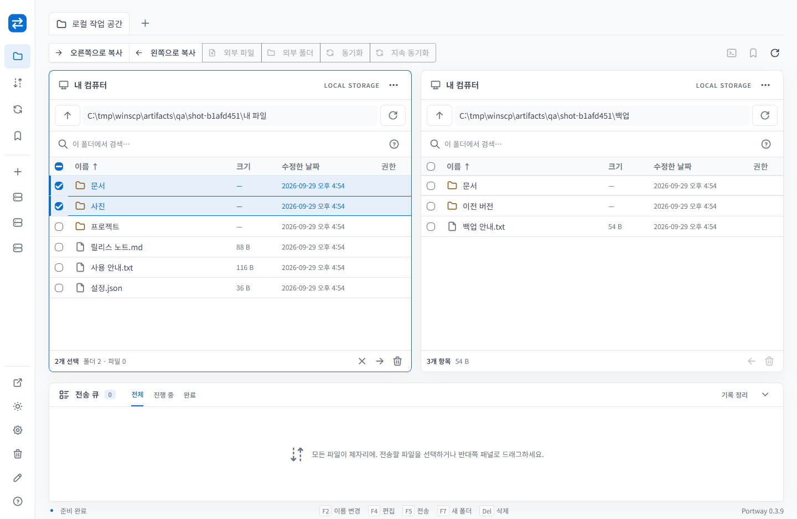
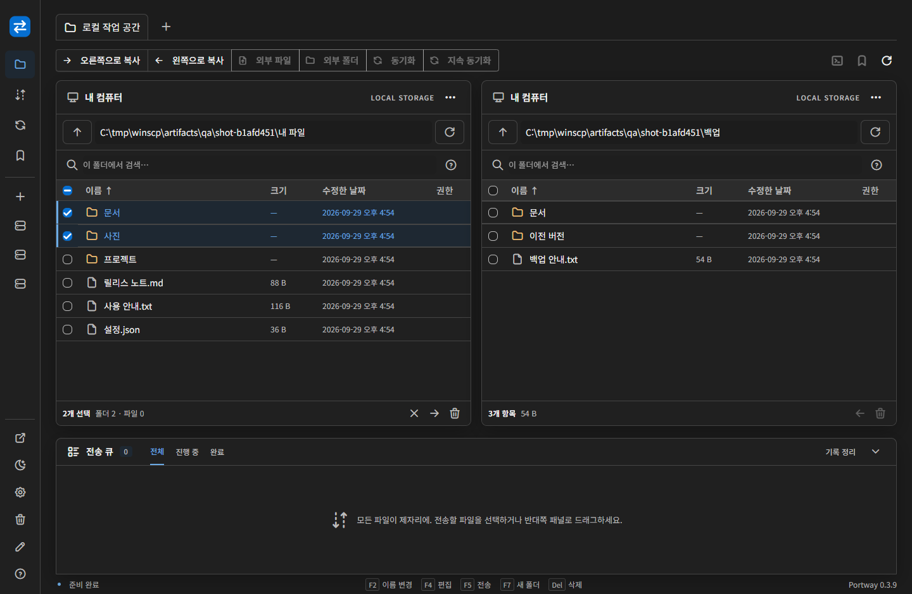

# Portway 0.3.1 최종 검증

검증일: 2026-09-28. 외부 파일·폴더 드롭, Tabler CSS·Tabler Icons 웹 폰트·Master CSS, 앱/배포 센터 라이트·다크·시스템 테마와 `AGENTS.md`를 포함한 최종 릴리스입니다.

0.3.0의 브라우저 검증 이후, 임시 사본을 공유하는 다른 큐 작업이 있으면 정리하지 않도록 보강했습니다. 정리와 무관한 잘못된 전송 경로는 건너뛰고, NFC/NFD 유니코드 이름 충돌을 거부하며, 준비 파일을 새 파일 생성 모드로만 엽니다.

| 항목 | 결과 |
|---|---|
| Windows 전체 .NET 테스트 | **79 통과**, 실패/건너뜀 0. `tests/Portway.Tests/TestResults/windows-0.3.1.trx` |
| Linux 전체 .NET 테스트 | **78 통과**, 실패 0, Windows 전용 공식 WinSCP 테스트 1 건너뜀. `artifacts/qa/linux-results-031/linux-0.3.1.trx` |
| 프런트엔드 수집 테스트 | **4 통과**. 실제 제품 `drop.js` 모듈을 사용 |
| Windows 0.3.1 패키지 게시·해시·다운로드 | **1 통과**. `package-0.3.1.trx`. 전체 Windows 실행의 0.3.0 ZIP 검증과 별도로 최종 ZIP 재검증 |
| Linux 0.3.1 패키지 게시 | 전체 Linux 테스트에서 새 0.3.1 AppImage 포함 ZIP으로 검증 |
| Windows 설치/업데이트 | 격리된 0.1.0 설치 → 0.3.1 다운로드/적용 → Photino 실제 창 재시작 → API 버전 확인 → 제거 통과 |
| Windows 패키지 API 회귀 | 인증·Origin 차단, 실제 큐 업로드, 내부 편집·권한 보존·동시 수정 거부 통과 |
| Linux AppImage | 0.3.1 AppImage를 Xvfb에서 실제 실행, 12초 유지 후 테스트 종료 통과 |
| macOS ARM64 | 0.3.1 자체 포함 게시 빌드 성공. 실제 Mac 실행은 미검증 |
| 배포 서버 | `portway-distribution:0.3.1` 이미지 빌드 성공. API 테스트 통과. 디자인 화면은 동일 UI인 0.3.0에서 검토 |

설치 증거: `artifacts/qa/PortwayQa7a5c976a75bb48b5a29971f876b5a276/result.txt`.

최종 **0.3.1 Windows 게시 실행 파일**에서도 실제 로컬 파일 경로를 Chromium CDP 드롭으로 전달해 SFTP 업로드를 다시 수행했습니다. 108개 파일, 4개 폴더, 중첩/빈/한글 폴더, 105개 항목이 든 폴더, 9 MiB+17바이트 다중 청크 파일, 0바이트 파일을 확인했습니다. 충돌 정책을 덮어쓰기로 지정해 실제 업로드를 수행했습니다.

전송 전후 큰 파일의 SHA-256은 `6f43279c24d699e11de05fa68ba6743033fff4ba2eaedc48e3fdccf13b0b27a4`로 일치합니다. 105개 항목과 빈 폴더, 0바이트 파일도 직접 확인했습니다. UI 콘솔 오류·경고는 0개입니다. Chromium 인증 폼 안내 1개는 verbose 메시지입니다.

준비 중 취소/임시 파일 정리, 시스템 테마 변경 추적, 테마 저장·복원, 980×680 창 검증은 [0.3.0 상세 보고서](VALIDATION-0.3.0.md)에 기록했습니다. 0.3.1 패키지에서 테마 복원과 라이트/다크 화면을 재확인했고, 모든 Desktop 웹 자산이 소스와 같은 해시임을 검사했습니다. 새 디자인 패키지의 라이선스와 웹 폰트도 배포본에 포함돼 있습니다.

## 산출물

- `dist/releases/win-x64-stable/Portway-win-x64-stable-Setup.exe`
- `dist/releases/win-x64-stable/Portway-win-x64-stable-Portable.zip`
- Windows 0.3.1 full 및 0.3.0 → 0.3.1 delta nupkg
- `dist/releases/linux-x64-0.3.1-stable/Portway-linux-x64-stable.AppImage`
- `dist/Portway-0.3.1-win-x64-stable.zip`, `dist/Portway-0.3.1-linux-x64-stable.zip`
- `dist/SHA256SUMS-0.3.1.txt`, [기계 판독 검증 기록](verification-0.3.1.json)

Windows 설치 파일은 미서명입니다. Linux Xvfb에서는 GPU 가속 경고가 있었으나 앱은 실행됐습니다. 테스트용 프로세스와 Docker 서버는 종료했고 패키지·로그·스크린샷은 보존했습니다.

## 남은 검증 경계

실제 Explorer/Finder/리눅스 파일 관리자와 **Photino 네이티브 창 사이의 OS 드래그 제스처**는 직접 조작하지 않았습니다. Chromium의 실제 파일 경로 드롭 테스트가 WKWebView/WebKitGTK 실기기 인수 테스트를 대체하지 않습니다. macOS 설치·실행·업데이트·서명/공증, ARM64 실기기, 공개 도메인 배포도 미검증입니다. 앱 → OS 파일 관리자 드래그아웃은 이번 구현 범위에 포함하지 않습니다.

재현 명령과 아키텍처: [AGENTS.md](../../../AGENTS.md), [드롭·디자인 시스템](../docs/DESIGN-AND-DROP.md). 이전 보고서 명령의 버전 경로를 `0.3.1`로 지정하면 같은 검증을 재현할 수 있습니다. 이미 생성한 버전별 패키지를 덮어쓰지 않으므로 새 빌드에는 새 버전을 사용합니다.
