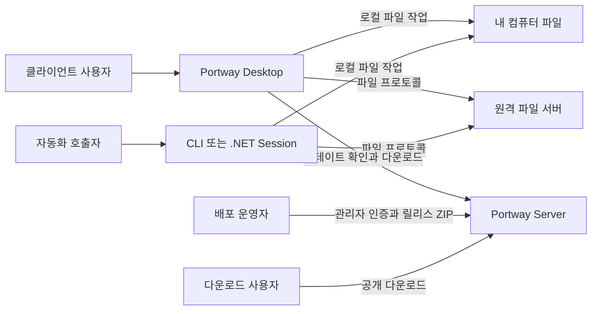
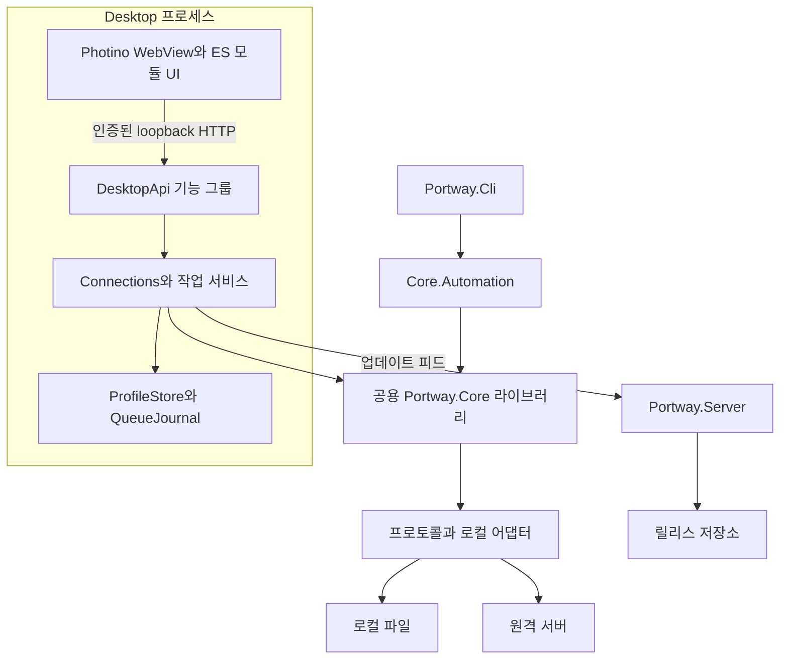

# Portway 아키텍처 — 현재 구조와 책임

Portway는 Desktop·CLI가 Core를 이용해 파일 서버에 직접 접근하고, 별도 Server가 클라이언트 릴리스를 배포하는 구조입니다. 웹 UI가 로컬 API를 호출하는 경계와 실제 프로토콜 통신 경계를 구분해야 합니다. 기준 커밋·버전·검증 수준은 [읽기 안내](README.md)에 있습니다.

## 시스템 컨텍스트

Server가 Desktop의 파일 전송을 중계하지 않습니다. Desktop 실행 중에는 일반 원격 파일 서버만 있어도 해당 작업이 가능하고, 업데이트 피드가 없으면 자동 업데이트는 비활성입니다. 근거: [RemoteFactory](../../../../src/Portway.Core/RemoteFactory.cs), [Desktop Program](../../../../src/Portway.Desktop/Program.cs), [UpdateService](../../../../src/Portway.Desktop/UpdateService.cs), [ServerApi](../../../../src/Portway.Server/ServerApi.cs).

## 프로젝트·구성 요소 경계

| 영역 | 책임과 의존 관계 |
| --- | --- |
| Core | `IRemoteFileSystem`, Site·Entry·Capabilities, 프로토콜, 경로 보호·암호화, 전송·동기화와 자동화. 프로젝트 참조 없음, UI 의존 없음 |
| Desktop | Core 참조. Photino 창·Kestrel loopback API·프로필·금고·영속 큐·작업 서비스·ES 모듈 UI |
| CLI | Core 참조. 명령줄·스크립트 입력, 취소와 종료 코드. Photino·Desktop API 의존 없음 |
| Server | 릴리스 게시·피드·파일 저장소·다운로드 대시보드. Core·Desktop 프로젝트 참조 없음 |
| Frontend 자산 | 고정 npm 버전으로 Tabler·Icons·Master CSS·Noto Sans KR·Monaco·xterm 등을 로컬 자산으로 생성. 런타임 CDN 불필요 |
| Tests·Document | Tests는 Core·Desktop·Server 검증. Document는 Node 콘솔과 가이드·검증 기록, 앱 런타임과 별개 |

프로젝트 관계는 [Portway.slnx](../../../../Portway.slnx)와 각 `.csproj`, 자산 관계는 [package.json](../../../../assets/frontend/package.json)·[build.cjs](../../../../assets/frontend/build.cjs)이 근거입니다. 주요 기준은 .NET 10, Photino.NET 4.0.16, Velopack 1.2.158이며 정확한 패키지 값은 프로젝트·lockfile을 확인합니다.

이 도식은 논리 의존 관계입니다. Core는 Desktop과 CLI 각각의 프로세스에 포함되는 라이브러리이며 공유 실행 서버가 아닙니다. Desktop API는 [DesktopApi](../../../../src/Portway.Desktop/DesktopApi.cs)가 `/api` 그룹을 조립하고 `Api/DesktopApi.*.cs`가 기능별 경로를 등록합니다. 처리 책임은 서비스와 Core에 있습니다. UI 마크업은 뷰 모듈, API·이벤트·상태 조립은 [app.js](../../../../src/Portway.Desktop/wwwroot/app.js)와 기능 모듈이 맡습니다.

`RemoteFactory.Create`는 사이트를 검증해 프로토콜 구현을 선택하고 `GuardedRemote`·`EncryptedFileSystem`·터널을 조합합니다. 전송은 `TransferOperations`, 비교·적용은 `Synchronizer`가 담당합니다. [프로토콜별 capability](ANALYSIS.md#protocols)는 기능 실행의 제한 기준입니다.

## 실행·종료·동시성·복구

1. `Program.Main`은 STA에서 Velopack을 초기화하고 준비된 업데이트를 UI·파일 작업 전에 적용합니다.
2. 실행별 Bearer와 임의 loopback 포트를 구성하고 DI·보안·정적 자산·API를 등록해 호스트를 시작합니다.
3. 일반 실행은 전용 `DataPath/webview` 폴더의 Photino 창을 열고, headless QA는 같은 HTTP 호스트만 사용합니다. Debug에서만 개발자 도구를 활성화합니다.
4. `AutomaticUpdateWorker`는 호스트 시작 완료 후 준비 작업을 수행합니다. 큐·지속 동기화·드롭은 hosted service로 실행됩니다.
5. 창 닫기·호스트 종료는 worker 취소와 연결·서비스 정리를 수행합니다. 큐는 중단 상태를 저장하고 다음 생성 시 일시정지로 복원합니다.

근거: [Program](../../../../src/Portway.Desktop/Program.cs), [DesktopHosting.AddDesktopServices](../../../../src/Portway.Desktop/DesktopHosting.cs), [AutomaticUpdateWorker](../../../../src/Portway.Desktop/AutomaticUpdateWorker.cs), [TransferQueue](../../../../src/Portway.Desktop/TransferQueue.cs).

| 자원·작업 | 조정 방식 | 경계 |
| --- | --- | --- |
| UI 연결 | `Connections.Use`의 연결별 semaphore | 같은 연결의 작업 직렬화. 전역 서버 잠금은 아님 |
| 전송 큐 | API singleton과 worker가 동일 인스턴스, 최대 8 worker·설정상 1–8 실행 | 전송마다 별도 파일 시스템 연결. UI 탭 수명과 작업 수명이 분리됨 |
| 일회·지속 동기화·외부 편집 | 작업용 연결 생성, 취소와 서비스별 상태 관리 | 일회 계획·외부 감시 세션은 메모리. 지속 등록과 복구 사본의 영속성은 별도 |
| 업데이트 | `UpdateService.Exclusive`의 semaphore | 자동·수동 확인·다운로드·적용 직렬화. 실행 중 자동 재시작 없음 |
| 저장·게시 | ProfileStore/QueueJournal 내부 잠금, Server 채널별 semaphore | 동일 프로세스 조정. Server 공유 볼륨의 다중 writer 조정은 구현하지 않음 |

연결을 닫았다고 이미 시작한 모든 백그라운드 작업이 끝났다고 가정하지 않습니다. 큐·watch·editor 상태를 각각 확인해야 합니다. 수명·저장 파일·상태 전이는 [설계서](DESIGN.md#data)에서 설명합니다.

## 보안과 데이터 신뢰 경계

| 경계 | 현재 보호 | 제한과 해석 |
| --- | --- | --- |
| UI → Desktop HTTP | IPv4 loopback listen, Host `127.0.0.1`, 실행 Bearer의 고정 시간 비교, 존재하는 Origin의 동일 출처 검사, API no-store, CSP·보안 헤더 | 네트워크 공개 API가 아님. 인증 URL·QA 토큰을 문서나 로그에 공유하지 않음 |
| Core → 파일 서버 | SSH 지문, TLS 검증과 정확한 핀, 사이트·인증 설정 검증 | 지문 조회가 서버 신뢰 확인을 자동 대체하지 않음. 서버·인증 조합별 실제 검증 필요 |
| 메모리 → 저장·내보내기 | ProfileStore의 PBKDF2/AES-GCM 금고, `SiteSecrets.Public/Map`, 잠금·종료 시 키 초기화 | 금고와 파일 암호화는 별개. 공개 모델 제거와 실제 필요한 비밀 검증을 구분 |
| 외부 경로 → 파일 작업 | `RemotePaths/GuardedRemote`, 로컬 전송의 동일·포함 경로·링크 검사, DropStore 전용 staging 검증 | 사용자 삭제·덮어쓰기 확인과 충돌 정책 필요. 외부 파일 시스템 전체에 대한 샌드박스는 아님 |
| 게시자 → Server → 업데이트 | 별도 게시 Bearer, ZIP 이탈·중복·링크·크기·피드 검사, 패키지 해시와 불변성, 피드 마지막 교체 | 피드에 SHA256이 있으면 추가 검사. 해시만으로 게시자 신원을 인증하지 않음. HTTPS·운영 권한·OS 서명과 별도 |

근거: [DesktopHosting](../../../../src/Portway.Desktop/DesktopHosting.cs), [ProfileStore](../../../../src/Portway.Desktop/ProfileStore.cs), [SiteSecrets](../../../../src/Portway.Core/SiteSecrets.cs), [Paths](../../../../src/Portway.Core/Paths.cs), [GuardedRemote](../../../../src/Portway.Core/GuardedRemote.cs), [SshConnection](../../../../src/Portway.Core/Protocols/SshConnection.cs), [TlsOptions](../../../../src/Portway.Core/Protocols/TlsOptions.cs), [ReleaseStore](../../../../src/Portway.Server/ReleaseStore.cs).

## 빌드·패키징·배포 구조 — REQ-013·014

프런트엔드 빌드가 로컬 자산을 생성하고 .NET 게시 결과에 복사합니다. `scripts/build.ps1`은 Desktop과 CLI를 self-contained로 게시한 뒤 `package.ps1`을 호출합니다. 게시 폴더는 `dist/publish/<RID>/<version>`, 패키지는 `dist/releases/<RID>-<track>/<version>`, 업로드 ZIP은 해당 버전의 결과만 담습니다. 기존 출력 경로를 새 버전으로 덮어쓰지 않습니다.

Full은 신규 설치·복구의 기준이고 Delta는 이전 Full을 바탕으로 생성합니다. CI는 같은 채널의 이전 Full을 URL에서 확보할 수 있고 최초 빈 채널만 명시적으로 허용합니다. Server는 기존 Full/Delta 피드를 병합하고 새 Delta의 `BaseVersion`과 버전 불변성을 검사합니다. 다운로드·복원·손상 시 Full 전환은 Velopack 관리자를 사용합니다. 자동 업데이트의 다음 시작 적용과 실제 설치 검증은 별개입니다.

운영 예시는 Caddy의 HTTPS 앞에 단일 Server 컨테이너와 릴리스 볼륨을 둡니다. Windows는 WebView2, macOS는 시스템 WebKit, Linux는 GTK/WebKitGTK·그래픽 환경이 필요합니다. OS별 CI·서명 설정은 구성 근거이며 실제 대상 장비의 설치·시작 성공 증거가 아닙니다.

근거: [build.ps1](../../../../scripts/build.ps1), [package.ps1](../../../../scripts/package.ps1), [ReleaseStore.Feeds](../../../../src/Portway.Server/ReleaseStore.Feeds.cs), [release.yml](../../../../.github/workflows/release.yml), [compose.production.yaml](../../../../compose.production.yaml), [개발자 가이드](../DEVELOPER-GUIDE.md), [배포 운영](../DEPLOYMENT.md). 현재 설치·OS 검증 범위는 [분석서](ANALYSIS.md#verification)를 따릅니다.

## 관찰한 설계 선택과 제약

다음은 현재 코드의 선택과 그 기대 효과에 대한 해석입니다. 원래 ADR이나 승인된 의사결정 이유를 확인한 기록이 아닙니다.

| 관찰한 선택 — 구현 확인 | 기대 효과 — 추론 | 현재 제약·근거 |
| --- | --- | --- |
| Core를 UI와 분리하고 CLI가 재사용 | 화면과 자동화에 같은 파일 정책 적용 | Desktop 작업 저널을 CLI에 자동 제공하지 않음. [Session](../../../../src/Portway.Core/Automation/Session.cs) |
| Photino + 인증된 로컬 HTTP API | 네이티브 창에서 웹 UI 활용, 브라우저 QA 가능 | 네이티브 WebView·프로필·그래픽 환경의 OS별 검증 필요. [Program](../../../../src/Portway.Desktop/Program.cs) |
| 연결·작업·화면 수명 분리 | 탐색 중에도 백그라운드 작업 제어 | 별도 연결과 취소·복구 상태 관리 필요. [Connections](../../../../src/Portway.Desktop/Connections.cs)·[TransferQueue](../../../../src/Portway.Desktop/TransferQueue.cs) |
| 큐 저널·복원 후 일시정지 | 사용자가 대상·원본을 확인한 뒤 재개 | 강제 종료 전체 조건 보장은 없음. [QueueJournal](../../../../src/Portway.Desktop/QueueJournal.cs) |
| 로컬 전송을 다운로드 어댑터로 구성 | 전송 엔진·충돌·복구 정책 재사용 | 링크·포함 경로 차단과 바이너리 제한. [LocalTransferFileSystem](../../../../src/Portway.Core/LocalTransferFileSystem.cs) |
| 오프라인 정적 웹 자산 | 앱 UI가 실행 시 CDN 가용성에 의존하지 않음 | 자산 빌드와 패키지 복사 결과 일치 필요. [build.cjs](../../../../assets/frontend/build.cjs) |
| 다음 시작 업데이트 + 불변 릴리스 피드 | 실행 중 파일 작업을 보호하고 기존 버전 유지 | 실제 설치와 서명·OS별 적용 검증 필요. [UpdateService](../../../../src/Portway.Desktop/UpdateService.cs)·[ReleaseStore](../../../../src/Portway.Server/ReleaseStore.cs) |

이 문서는 현재 구조만 복원합니다. 새로운 공통 추상화·멀티테넌트 서비스·목표 아키텍처·개선 로드맵을 제안하지 않습니다.
