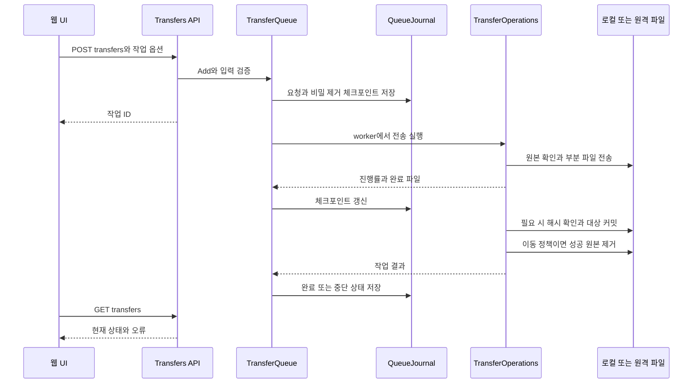
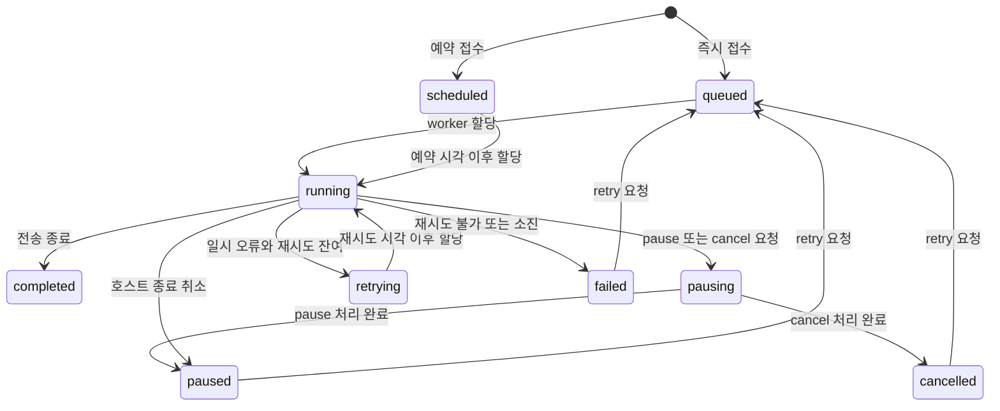
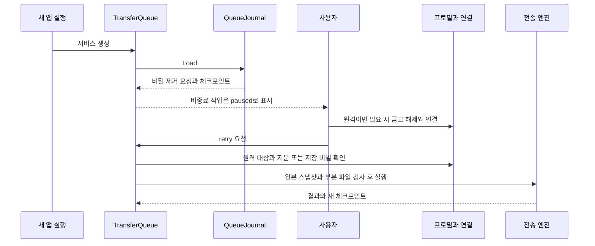
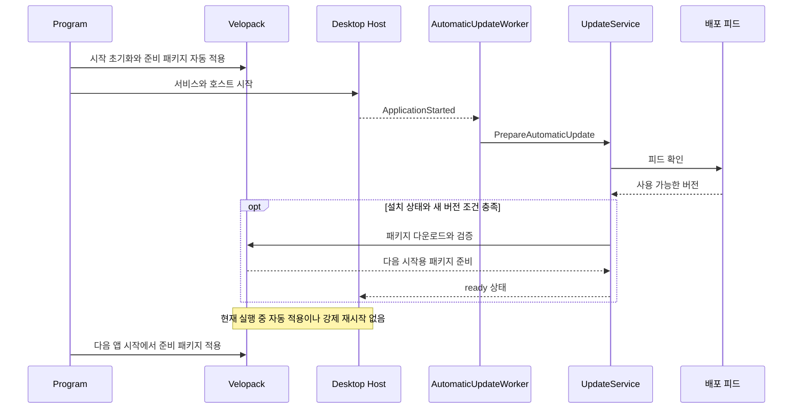

# Portway 설계서 — 사용자 흐름·데이터·상태

이 문서는 화면에서 시작한 작업이 어떤 데이터와 API를 거쳐 처리되는지 설명합니다. 설계 대상은 현재 개발 구현이며 재구현을 위한 전체 계약 명세는 아닙니다. 정확한 DTO와 전체 경로는 [API 목록](../API-REFERENCE.md), 요구사항·검증 근거는 [분석서](ANALYSIS.md#traceability)를 참고하세요.

## 화면과 연결 흐름 — REQ-001·002·003·015

| 화면·상태 | 사용 흐름 | 설계상 처리 |
| --- | --- | --- |
| 작업 공간 | 사이드바 → 연결 탭 → 두 파일 패널 → 전송 큐·상태바 | 로컬 탭은 양쪽 로컬 폴더. 서버 탭은 왼쪽 로컬·오른쪽 원격. `local/remote`는 패널 위치이며 파일 API 선택은 `isLocal(side)`로 판단 |
| 사이트·연결 | 새 사이트 입력 또는 저장 사이트 선택 → 필요 시 금고 해제·지문·추가 인증 → 연결 | `Connections.Connect`가 인증과 초기 목록을 완료한 뒤 ID를 등록. 연결 탭별 오른쪽 경로·선택·필터를 유지 |
| 목록·선택 | 경로 이동·정렬·필터 → 체크박스·범위·박스 선택 → 작업 | 경로 기반 선택. `load`가 패널 참조·요청 ID·현재 세션을 확인해 오래된 응답 제외. 단축키는 실제 목록 포커스 검사 |
| 팝업·오류 | 연결·전송·편집·설정 창에서 제출 → 오류 시 수정·재시도 | `modal()`이 새 dialog를 생성. 지연된 이전 close가 새 창을 정리하지 않음. 모달의 최상위 레이어에 토스트 표시 |
| 테마·표시 | 라이트/다크 선택, 연결 시간·파일 날짜 확인 | 최초 또는 과거 `system` 설정은 OS 밝기를 1회 해석해 고정. 파일 날짜는 현지 시간, 접속 시간은 연결별 시작점 유지 |

근거: [app.js](../../../../src/Portway.Desktop/wwwroot/app.js)의 `boot/load/connect/modal`, [explorer.js](../../../../src/Portway.Desktop/wwwroot/explorer.js), [theme.js](../../../../src/Portway.Desktop/wwwroot/theme.js), [display-time.js](../../../../src/Portway.Desktop/wwwroot/display-time.js). 화면 골격은 [workspace-view.js](../../../../src/Portway.Desktop/wwwroot/workspace-view.js), 파일 행은 [file-list-view.js](../../../../src/Portway.Desktop/wwwroot/file-list-view.js)에서 생성합니다.

사이트의 Enter 제출은 한글 조합·중복 제출과 저장만 버튼을 구분합니다. 화면 최소 크기는 `Program.Main`의 980×680이며, 사이드바는 64px 아이콘 열과 260px hover 펼침을 사용합니다. 구현된 접근성 이름·포커스·모션 처리와 실제 접근성 인증은 구분합니다.

## 핵심 데이터와 수명

관계형 데이터베이스를 사용한다고 가정하지 않습니다. 프로필과 작업 등록은 JSON 파일, 실행 상태는 메모리, 드롭·편집·업데이트는 파일을 함께 사용합니다.

| 데이터 | 내용·관계 | 저장과 수명 |
| --- | --- | --- |
| Site·금고·Preferences | 서버 메타데이터, 암호화 비밀, 테마·전송 기본값·업데이트 URL | `ProfileStore.DataPath` 아래 `sites.json/vault.json/preferences.json`. 잠금 해제 키는 메모리이며 잠금·종료 시 지움 |
| UI 연결·패널 | 연결 ID·capability·원격 파일 시스템, 화면 경로·선택·필터 | `Connections`와 UI 메모리. 저장 사이트 ID와 실행 연결 ID는 별개. 탭 닫기와 앱 종료에 따라 정리 |
| TransferRequest·Job·Checkpoint | 원본·대상·옵션·상태·완료 파일·원본 스냅샷 | `queue/<작업ID>.json`. 공개 Site만 저장. 종료 작업은 큐 정리 시 저널 제거, 비종료 작업은 재시작 시 일시정지 |
| 드롭 스냅샷 | 상대 경로 manifest와 staging 파일, 업로드 큐의 원본 | `drops/<배치ID>/manifest.json`과 `files/`. 완성 후 sealed·큐 접수. 큐가 참조하는 동안 재시도·재시작을 위해 보존 |
| SyncPlan·SavedWatch | 변경 목록과 스냅샷, 지속 동기화 등록과 사이트 | 일회 계획은 메모리·30분 만료. 지속 등록은 `watches.json`, 비밀 제거·일시정지 복원 |
| 편집 문서·복구 사본 | 내용·ETag·인코딩·BOM·저장 스냅샷 | 내장 모델은 창 수명. 원격 읽기용 임시 파일은 작업 후 제거. 외부 편집 `editor/<ID>/` 사본은 종료 후에도 보존하고 감시 세션은 자동 복원하지 않음 |
| 휴지통 기록·실제 항목 | 원위치·보관 위치·사이트·처리 상태 | `trash.json`과 원본 부모의 `.portway-trash/<ID>/`. OS 휴지통과 별개. 복원은 원위치 충돌과 서버 검증 필요 |
| 업데이트 캐시·서버 피드 | 준비 패키지, 채널·버전·Full/Delta·해시 | 설치 관리자의 캐시와 Server 저장소. 다음 시작 적용, 서버 기존 패키지 보존. 업로드 ZIP 자체는 영구 저장하지 않음 |

근거: [Models](../../../../src/Portway.Core/Models.cs), [ProfileStore](../../../../src/Portway.Desktop/ProfileStore.cs), [QueueJournal](../../../../src/Portway.Desktop/QueueJournal.cs), [DropStore](../../../../src/Portway.Desktop/DropStore.cs), [SyncService](../../../../src/Portway.Desktop/SyncService.cs), [LiveSyncService](../../../../src/Portway.Desktop/LiveSyncService.cs), [ExternalEditorService](../../../../src/Portway.Desktop/ExternalEditorService.cs), [TrashService](../../../../src/Portway.Desktop/TrashService.cs), [UpdateService](../../../../src/Portway.Desktop/UpdateService.cs), [ReleaseStore](../../../../src/Portway.Server/ReleaseStore.cs).

## 대표 인터페이스 — REQ-012·013 및 공통 계약

Desktop API는 앱의 `http://127.0.0.1:<port>`에서 현재 실행의 Bearer로 호출합니다. JSON 필드는 camelCase입니다. 아래 응답은 의미를 요약한 것으로, 전체 필드·기본값은 [Core 모델](../../../../src/Portway.Core/Models.cs)과 [Desktop DTO](../../../../src/Portway.Desktop/Api/DesktopApi.Contracts.cs)를 확인합니다.

| 인터페이스 | 핵심 입력·응답 | 사용상 구분 |
| --- | --- | --- |
| `POST /api/sessions` | Site → 연결 `id`, 초기 `listing`, `capabilities` | 저장 사이트 ID를 연결 ID로 사용할 수 없음 |
| `GET /api/local`, `GET /api/remote/{id}` | 경로 → Listing | 오른쪽 로컬 패널도 `/api/local` 사용 |
| `POST /api/transfers` | `sessionId/direction/paths/destination/conflict/options` 등 → 작업 `id` | `direction: local`은 서버 세션 불필요. 완료는 `GET /api/transfers`로 별도 확인 |
| `POST /api/transfers/{id}` | `action`, 선택적 `sessionId` | pause/cancel/retry·우선순위 제어. UI의 이어하기도 `retry` 요청 사용 |
| `POST /api/local/read`, `/api/remote/{id}/read` 및 대응 `/write` | path, 저장 시 content/etag/encoding/bom → 문서 | 원본의 ETag로 충돌 검사 |
| `POST /api/sync/preview`, `/api/sync/{id}/apply` | SyncRequest → 계획 ID·changes, selected/resolutions → 상태 | 전송 작업 ID와 동기화 계획 ID는 별개 |
| `POST /api/sites/import`, `/api/sites/export` | content → 가져온 수·건너뜀, 내보내기 결과 | JSON/지원 INI 읽기, 비밀 제거, Desktop은 OS 저장 창·headless는 다운로드 내용 |
| `GET /api/updates`, `POST /api/updates/check`, `/download`, `/apply` | 업데이트 상태·준비·적용 | Ready가 현재 실행 버전 변경을 뜻하지 않음 |
| Server `POST /api/releases/{channel}` | 별도 게시 Bearer, `application/zip` → 게시 요약 | Desktop 토큰과 별개. `GET /releases/{channel}/{file}`은 공개·Range 지원 |

Desktop의 일반 작업 예외는 400, 없는 파일·연결은 404, 상태 충돌은 409와 `title/detail/status`로 처리합니다. 인증 실패는 401, Host·Origin 거부는 403이며 같은 오류 본문을 가정하지 않습니다. 프레임워크 바인딩 오류도 별도입니다. Server 게시의 키 미설정 503·인증 실패 401·Content-Type 415·속도 제한 429는 [ServerApi](../../../../src/Portway.Server/ServerApi.cs)와 [Program](../../../../src/Portway.Server/Program.cs)에서 확인합니다.

CLI 입력은 `--script file.txt`, `/script=file.txt`, `/command` 또는 `--command`의 명령 배열입니다. `ScriptEngine.Run`은 오류를 JSON으로 출력하며 성공 0·실패 1을 반환하고 CLI 취소는 130입니다. `batch continue`도 오류가 있으면 최종 1입니다. .NET `Session`은 `Open/ListDirectory/PutFiles/GetFiles/CompareDirectories/SynchronizeDirectories/Close` 등을 제공하며 Progress 이벤트·예외·CancellationToken으로 제어합니다. Desktop의 영속 큐나 금고를 자동 경유하지 않습니다. 근거는 [CLI Program](../../../../src/Portway.Cli/Program.cs), [ScriptEngine](../../../../src/Portway.Core/Automation/ScriptEngine.cs), [Session](../../../../src/Portway.Core/Automation/Session.cs)입니다.

## 전송과 외부 드롭 — REQ-004·005·007

근거: [Transfers API](../../../../src/Portway.Desktop/Api/DesktopApi.Transfers.cs), [TransferQueue](../../../../src/Portway.Desktop/TransferQueue.cs), [TransferOperations](../../../../src/Portway.Core/TransferOperations.cs). 도식은 반복 전송을 한 파일 흐름으로 축약합니다. 임시 커밋·이어하기·메타데이터 적용은 프로토콜과 전송 옵션에 따르며 모든 서버에 동일한 원자성을 보장하지 않습니다.

로컬 복사도 같은 큐를 사용합니다. `LocalTransferFileSystem.Validate`가 대상 관계·링크·중복 이름을 검사하고 텍스트 변환을 차단합니다. worker는 이 어댑터를 다운로드 원본처럼 사용하므로 원격 서버를 만들지 않습니다.

외부 드롭은 `captureDrop → collectDrop → manifest 생성 → 청크 Append → 완전성 검사·Commit → 큐` 순서입니다. 청크는 최대 8 MiB, 항목은 최대 20,000개이며 폴더 묶음을 끝까지 읽어 빈 폴더도 보존합니다. 브라우저는 원본 OS 경로를 추측하지 않습니다. staging 준비 취소와 접수된 큐 작업 취소의 수명이 다르며, 전송 후 원본 사용자 파일은 그대로 유지합니다. 근거: [drop.js](../../../../src/Portway.Desktop/wwwroot/drop.js), [DropStore](../../../../src/Portway.Desktop/DropStore.cs).

## 큐 상태와 재시작 복구 — REQ-006

이 도식은 [TransferQueue](../../../../src/Portway.Desktop/TransferQueue.cs)의 정상 처리·실행 중 제어를 요약합니다. 실행 전 작업도 `pause/cancel`로 바로 일시정지·취소할 수 있습니다. 재시작 시 저널의 `completed/cancelled/failed`는 유지하고 그 밖의 상태는 `paused`로 복원합니다. 복구는 도식상의 자동 `queued` 전이가 아닙니다.

로컬 작업은 금고·서버 연결 없이 복구합니다. 원격 복구의 연결 선택 시 대상·SSH 지문을 비교하고, 암호화 키 등 필요한 비밀은 실제 생성·연결 시 검증합니다. 원본이 바뀌면 새 전송이 필요합니다. 손상 JSON은 `QueueJournal.Load`가 별도 이름으로 격리합니다. 강제 종료·정전 전체 조합에 대한 보장으로 해석하지 않습니다.

## 편집과 고급 도구 — REQ-008·011

내장 편집은 파일 읽기 → Monaco 모델 생성 → 저장 스냅샷 → 원본 ETag 확인 → 저장 → 새 ETag 수용 순서입니다. `editor-state.js`는 제출 내용과 이후 입력을 분리합니다. 원격은 임시 파일 업로드 후 원본을 다시 비교하고 `TransferOperations.Commit`으로 반영합니다. 다른 프로그램이 바꾼 파일은 저장을 거부합니다. ETag 검사와 커밋 사이까지 외부 변경을 완전히 잠그는 서버 트랜잭션은 없습니다. 닫을 때 Monaco 모델·편집기·테마 구독을 해제합니다. 근거: [editor.js](../../../../src/Portway.Desktop/wwwroot/editor.js), [editor-state.js](../../../../src/Portway.Desktop/wwwroot/editor-state.js), [RemoteTextFiles](../../../../src/Portway.Desktop/RemoteTextFiles.cs).

외부 편집은 전용 로컬 사본을 열고 저장 변경을 감시해 업로드합니다. 서버 변경 시 `conflict`로 멈추며 사용자가 의도적으로 `overwrite`를 선택할 수 있습니다. `stop`·앱 종료 후에도 사본을 복구용으로 남깁니다. 터미널은 일반 SFTP/SCP 설정에서 별도 SSH PTY 연결을 생성하며 읽기·입력·크기 변경·닫기를 제공합니다. 링크·권한·검색·해시·복사는 capability와 구현을 따릅니다. 휴지통 복원은 기록된 원위치로 이동하되 기존 파일을 덮어쓰지 않습니다. 근거: [ExternalEditorService](../../../../src/Portway.Desktop/ExternalEditorService.cs), [TerminalService](../../../../src/Portway.Desktop/TerminalService.cs), [TrashService](../../../../src/Portway.Desktop/TrashService.cs), [Files API](../../../../src/Portway.Desktop/Api/DesktopApi.Files.cs).

## 동기화 흐름 — REQ-009·010

일회 동기화는 `SyncService.Preview → Synchronizer.Preview → 사용자 선택 → SyncService.Apply → Synchronizer.Apply`입니다. 방향은 upload/download/both이며 비교 기준은 checksum/time-size/size/time입니다. 미리보기의 스냅샷과 적용 직전 스냅샷이 다르면 거부하고, 같은 시각·다른 내용의 양방향 충돌은 방향을 선택합니다. 상태는 `preview → running → completed/cancelled/failed`이며 계획은 영속화하지 않습니다. 근거: [SyncService](../../../../src/Portway.Desktop/SyncService.cs), [Synchronizer](../../../../src/Portway.Core/Synchronizer.cs).

지속 동기화는 등록 즉시 `watching`에서 감시·주기 비교하며 실행 시 `running`, 성공 후 `watching`, 재시도 시 `retrying`입니다. 중지·종료 후 `paused`, 복구 불가 오류는 `failed`로 표시합니다. 단방향 등록만 허용하고 다음 시작에는 등록을 `paused`로 읽습니다. `resume`은 같은 서버·SSH 지문을 확인합니다. 근거: [LiveSyncService](../../../../src/Portway.Desktop/LiveSyncService.cs)의 생성자·`Add/Control/Run`.

## 자동 업데이트 흐름 — REQ-014

기본 상태는 `idle`, URL이 없으면 `disabled`, 설치 관리 대상이 아니면 `unavailable`입니다. 확인 후 `checking → current/available`, 다운로드는 `downloading → ready`이며 실패·취소는 `error/cancelled`로 표시합니다. 자동 준비와 수동 요청은 같은 semaphore를 사용합니다. 수동 `/apply`는 큐·일회/지속 동기화·외부 편집의 활성 여부를 검사한 뒤 업데이트 관리자의 재시작 적용을 호출합니다. 근거: [Program](../../../../src/Portway.Desktop/Program.cs), [AutomaticUpdateWorker](../../../../src/Portway.Desktop/AutomaticUpdateWorker.cs), [UpdateService](../../../../src/Portway.Desktop/UpdateService.cs), [Updates API](../../../../src/Portway.Desktop/Api/DesktopApi.Updates.cs).
