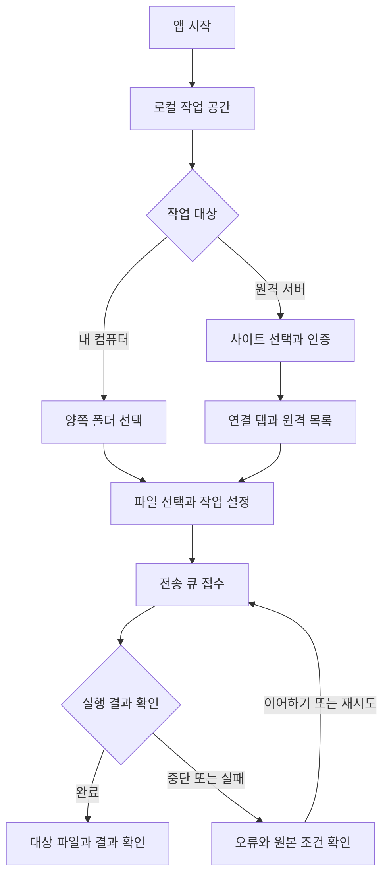

# Portway 기획서 — 현재 구현에서 복원

Portway는 로컬 컴퓨터와 원격 서버의 파일을 탐색·전송·편집·동기화하는 데스크톱 앱과 자동화 도구입니다. 아래 제품 목적과 예상 사용자는 구현으로부터 복원한 가설이며, 기능과 성공 조건은 현재 코드의 동작을 기준으로 합니다. 분석 기준과 근거 표시 규칙은 [읽기 안내](README.md)에 있습니다.

## 제품 목적과 예상 사용자

**추론:** 여러 프로토콜의 파일 작업을 하나의 화면과 전송 정책으로 수행하고, 반복 작업은 CLI와 .NET API로 실행하려는 요구를 다룹니다. 전송 중단·파일 충돌·인증 정보 보관을 관리할 수 있다는 점이 제품의 제공 가치입니다. 실제 업무 시간 절감이나 장애 감소 효과는 측정 근거가 없습니다.

| 예상 사용자·상황 — 추론 | 현재 제공 수단 | 근거 |
| --- | --- | --- |
| 서버 파일을 관리하는 개발자·운영 담당자 | 연결 탭, 탐색·전송·편집·SSH 터미널 | [사용 흐름](../USER-GUIDE.md), [작업 UI](../../../../src/Portway.Desktop/wwwroot/workflows.js) |
| 컴퓨터 안에서 폴더를 정리하는 사용자 | 양쪽 로컬 패널, 큐 기반 복사·이동 | [로컬 전송 어댑터](../../../../src/Portway.Core/LocalTransferFileSystem.cs) |
| 반복 전송을 실행하는 자동화 담당자 | CLI 스크립트와 프로세스 내부 .NET Session | [자동화 가이드](../AUTOMATION.md) |
| 클라이언트 배포 운영자 | 채널별 릴리스 게시·다운로드와 업데이트 피드 | [배포 API](../../../../src/Portway.Server/ServerApi.cs) |

클라이언트 사용자와 배포 운영자는 서로 다른 사용 상황입니다. Desktop에는 사용자·조직 계정 관리가 없고, 배포 게시 권한은 별도 관리자 키로 제어합니다.

## 현재 기능과 성공 조건

다음 ID는 [분석서의 추적표](ANALYSIS.md#traceability)에서 구현·테스트 근거와 연결됩니다. 성공 조건은 현재 구현을 설명하는 검토 기준이며, 모든 항목의 실제 환경 검증 완료를 뜻하지 않습니다.

| ID | 기능 | 사용자 관점의 성공 조건 |
| --- | --- | --- |
| REQ-001 | 두 패널 탐색·선택 | 정렬·필터 후 의도한 경로를 선택하고, 파일 목록에 포커스가 있을 때 단축키로 작업한다 |
| REQ-002 | 사이트 연결·인증 | 지원 프로토콜로 인증하고 초기 목록을 조회한 연결을 탭으로 사용한다. 잘못된 SSH 지문·TLS 검증은 거부한다 |
| REQ-003 | 사이트·금고·이전 | 저장한 비밀은 잠금 해제 후 사용하고, 내보내기는 비밀을 제거하며 가져오기는 기존 사이트를 보존한다 |
| REQ-004 | 원격 전송 | 업로드·다운로드에 충돌·필터·검증·이동 정책을 적용하고 결과를 큐에서 확인한다 |
| REQ-005 | 로컬 복사·이동 | 서버 없이 두 폴더 사이에서 내용·줄바꿈을 보존하며 복사하고, 이동은 성공한 항목만 원본에서 제거한다 |
| REQ-006 | 큐 제어·복구 | 진행·오류를 확인하고 일시정지·취소·재시도한다. 재시작 후 원본·연결 조건을 검사해 이어한다 |
| REQ-007 | 외부 파일·폴더 드롭 | 원격 패널에 놓은 파일·폴더를 준비한 뒤 큐로 업로드하고, 원본은 유지한다 |
| REQ-008 | 내장 텍스트 편집 | 지원 인코딩·BOM을 유지하고 변경된 원본의 덮어쓰기를 거부하며, 저장 중 추가 입력은 미저장으로 남긴다 |
| REQ-009 | 미리보기 동기화 | 변경 목록과 충돌 방향을 확인해 선택 적용하며, 미리보기 이후 원본 변경은 거부한다 |
| REQ-010 | 지속 동기화 | 단방향 감시·주기 비교를 제어하고, 재시작 후 등록을 일시정지 상태로 확인한다 |
| REQ-011 | 고급 파일 작업 | 지원 연결에서 검색·해시·권한·링크·터미널·외부 편집을 사용하고, 휴지통 복원 시 원위치 충돌을 확인한다 |
| REQ-012 | CLI·.NET 자동화 | UI 없이 같은 Core로 작업하고, 미지원 옵션·작업 오류·취소 결과를 호출자가 구분한다 |
| REQ-013 | 릴리스 게시·다운로드 | 관리자 키로 검증한 ZIP을 게시하고 채널별로 내려받는다. 같은 버전 패키지 내용을 변경하지 않는다 |
| REQ-014 | 클라이언트 업데이트 | 시작 후 백그라운드 준비를 수행하고 다음 시작에 적용한다. 준비 실패에도 앱 사용을 계속한다 |
| REQ-015 | 화면 설정·접근성 | 라이트·다크 선택을 유지하고 키보드·작은 창에서 작업 상태와 오류를 확인한다 |

## 대표 사용자 여정

이 흐름은 [app.js의 `boot`·`connect`·`transfer`](../../../../src/Portway.Desktop/wwwroot/app.js)와 [TransferQueue의 `Add`·`Control`](../../../../src/Portway.Desktop/TransferQueue.cs)을 요약합니다. 큐 접수 직후 완료로 표시하지 않습니다. 편집·동기화·고급 도구는 별도 작업 흐름이며 [설계서](DESIGN.md)에서 설명합니다.

## 제품 범위와 제약

- **프로토콜:** SFTP·SCP·FTP·FTPS·WebDAV/HTTPS·S3 구현이 있습니다. 권한·명령·이어하기 등 세부 지원은 [capability 표](ANALYSIS.md#protocols)와 서버 조건에 따릅니다.
- **호환성:** WinSCP INI의 일부 메타데이터 가져오기와 SFTP 파일 암호화 구현이 있습니다. WinSCPnet.dll·COM·전체 스크립트·레지스트리·작업 공간 이전을 제공하지 않습니다.
- **플랫폼:** Windows·macOS·Linux 대상 구성과 패키징 경로가 있습니다. 실제 배포·네이티브 검증 범위는 [검증 현황](ANALYSIS.md#verification)에 한정됩니다.
- **데이터 보호:** 전송과 편집에 충돌·복구 정책이 있으나 전체 동기화 작업의 트랜잭션 롤백이나 OS 휴지통 통합을 제공하지 않습니다.
- **OS 통합:** 앱에서 파일 관리자로 드래그아웃, 셸 확장, URL 핸들러 등은 미구현으로 기록되어 있습니다. 외부 파일 드롭의 브라우저 검증을 실제 Explorer/Finder 제스처 검증으로 확대하지 않습니다.

기능 상세 사용법은 [사용자 가이드](../USER-GUIDE.md), 기존 지원 한계는 [PARITY.md](../PARITY.md)를 참고합니다. 향후 기능 우선순위·목표 아키텍처·매출 계획은 이번 현재 구현 복원에 포함하지 않습니다.
